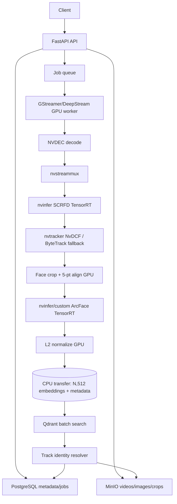

# Phase 0 Before Starting — MergenVision Final Repo

**Subtitle:** Source Code Audit, GStreamer/DeepStream Hotpath Plan, Model/Engine Strategy, Qdrant Identity Search, and Implementation Roadmap

---

## 1. Executive Summary

### 1.1 Why we are starting again

MergenVision has already proven that a photo-based face-recognition API backed by PostgreSQL, Qdrant, MinIO, TensorRT SCRFD, and ArcFace can work and can scale to more than one million enrolled faces on a single machine. The previous repositories, however, have accumulated three serious problems that make a clean final repo safer than incremental patching:

1. **Architecture drift between design docs and running code.** The clean source-of-truth repo (`/home/user/Workspace/mergenvision`) still relies on a Python video worker (`backend/app/infrastructure/workers/video_processor.py`) that explicitly contains a TODO for persistence and never writes crops, embeddings, or track identities to PostgreSQL/Qdrant/MinIO. The old TensorRT reference repo (`/home/user/MergenVision`) works but has no Alembic migrations, uses nginx round-robin load balancing instead of a queue, and builds static-per-batch TensorRT engines that are hard to operate.

2. **The video hotpath is not yet a real GPU hotpath.** Video frames are decoded on NVDEC via `PyNvGpuVideoCodec`, but detector outputs are copied to CPU dataclasses, selected frames are re-decoded from disk before recognition, recognizer batches are zero-padded per frame, and Qdrant is queried one face at a time. The current pipeline leaves a large fraction of the available GPU performance unused.

3. **Model and engine decisions are not locked behind a validation gate.** Several model files and engines exist, but there is no single locked manifest, no batch-invariance proof, no WIDERFace/LFW gate, and no DeepStream compatibility proof. Starting backend production code before these gates pass risks rebuilding the backend on top of a model stack that later has to change.

The most recent clean architecture repository, `/home/user/Workspace/MergenVisionCleanVersion`, already made the decision to use a **GStreamer + NVIDIA DeepStream** video hotpath, dynamic-batch TensorRT engines, and a **Phase 1 benchmark-only** gate before any production backend code. This report carries those decisions into `/home/user/MergenVisionProd` and turns them into a concrete, checkpointed implementation roadmap.

### 1.2 What was already solved in the previous repo

The previous clean repo solved Phase 1 photo recognition well: root-level API routes, camelCase public path parameters, UUIDv7 identifiers, layered architecture, SQLAlchemy 2.0 async repositories, Alembic baseline migrations, Qdrant as the vector store, MinIO for bytes, national-ID hashing, and a working TensorRT enrollment/identify pipeline. It also produced an LFW bulk-enrollment benchmark of ~184 faces/sec end-to-end with crop storage, or ~237 faces/sec when crop storage is skipped.

### 1.3 What must not be lost

- Root-level routes, no `/api/v1` prefix.
- `personId`, `photoId`, `requestId`, `jobId`, `faceIdentityId` as camelCase public path parameters.
- PostgreSQL for metadata, Qdrant for vectors, MinIO for bytes.
- No raw national ID in storage; `nationalIdHash` + `nationalIdMasked` only.
- No PII in Qdrant payload; payload is reference-only.
- Thin routers, application services own workflows, repositories own SQLAlchemy, infrastructure owns GPU runtime.
- `trackId != faceIdentityId`, track-level recognition, and real `FaceIdentity` rows for anonymous identities.

### 1.4 Why GStreamer/DeepStream is now preferred, and why ModelLab comes first

DeepStream keeps decoded video frames in `memory:NVMM` GPU buffers from `nvv4l2decoder` through `nvstreammux`, `nvinfer`, `nvtracker`, and custom crop/align probes, until only the final `[N,512]` embeddings and compact metadata cross to CPU. This removes the Python per-frame overhead, the re-decode of selected frames, and the per-face Qdrant round trip. Even if the detector is static batch=1, DeepStream still wins through NVDEC hardware decode, zero-copy buffers, and pipeline scheduling. Model validation must come before backend coding because TensorRT engine shapes, custom SCRFD parsers, and DeepStream `nvinfer` compatibility are prerequisites for the final API contract and database schema.

### 1.5 First three implementation checkpoints

1. **Checkpoint 1 — Repo skeleton and AGENTS.md/rules.** Create the directory layout, dependency strategy, and the same governance rules that exist in the clean architecture repo.
2. **Checkpoint 2 — Model source/license inventory and trusted model manifest.** Record exactly which SCRFD/ArcFace ONNX files will be used, their source URLs, licenses, and SHA-256 sums.
3. **Checkpoint 3 — Phase 1 ModelLab / DeepStream benchmark harness.** Build dynamic-batch TensorRT engines, a Python probe SCRFD parser, an optional C++ parser, GPU crop/align, and LFW/WIDERFace/speed benchmarks before writing any production backend code.

| Area | Previous repo status | New repo decision | Risk |
|---|---|---|---|
| Photo API | Working; 54+ tests pass, LFW bulk benchmark exists | Carry forward with minor cleanup | Low |
| TensorRT photo pipeline | Working with static profile engines | Upgrade to dynamic-batch engines; abstract inference backend | Medium |
| Video worker | Skeleton runs decode/detect/track, but persistence is TODO | Replace Python worker with DeepStream/GStreamer GPU hotpath | High if delayed |
| Tracker | ByteTrack-style pure Python, unit tested | Use `nvtracker` NvDCF in DeepStream; keep ByteTrack as fallback design | Medium |
| Identity resolver | Not implemented | Implement after model validation on top of Qdrant batch search | High |
| Queue | Redis/RQ implemented; master plan wanted PostgreSQL SKIP LOCKED | Decide explicitly; default to PostgreSQL SKIP LOCKED for video jobs | Medium |
| Qdrant | Vector store works, single-query search | Add batch query, quantization, HNSW tuning | Medium |
| Alembic | Baseline + video_job migration exist | Extend for `video_track`, `video_frame_detection`, `video_track_recognition_hit` | Low |
| Docker | Dev compose works; GPU base image exists | Add DeepStream base image and multi-GPU worker topology | Medium |
| Frontend | Refactor in flight in old repo | Defer to Phase 2/3; keep API-only focus | Low |

---

## 2. Repository Path and Source-of-Truth Inventory

| Path | Exists | Role | Notes |
|---|---|---|---|
| `/home/user/MergenVisionProd` | Yes | New final production repo | Currently only has `.git/`, empty `AGENTS.md`, empty `architecture/`, empty `backend/`, empty `documents/`, empty `frontend/`, empty `requirements/`. |
| `/home/user/Workspace/mergenvision` | Yes | Clean source-of-truth repo from last phase | Contains the working Phase 1 backend, Alembic, tests, Docker, and the most recent `projectultrareport.md`. Git working tree is dirty with many frontend renames and new docs. |
| `/home/user/MergenVision` | Yes | Old full-stack TensorRT/performance reference | Has 3-GPU nginx load-balanced compose, no Alembic, static batch engines, broken benchmark script, and large live production dataset evidence. |
| `/home/user/Demo/VideoFaceGpuLab` | Yes | ByteTrack, GPU decode, offline identity, worker claim reference | Contains PyNvVideoCodec + CuPy kernels, PostgreSQL `SKIP LOCKED` job claim, and tracker/resolver patterns. Also contains the `faceId == trackId` bug to reject. |
| `/home/user/Workspace/MergenVisionCleanVersion` | Yes | Latest architecture decision repo | Contains locked architecture docs (`GSTREAMER_DEEPSTREAM_QDRANT_ARCHITECTURE.md`, `TENSORRT_BATCHING_AND_ENGINE_STRATEGY.md`, `MODEL_RESEARCH_REPORT.md`, `MODEL_VALIDATION_PLAN.md`) and a `phase1/` benchmark harness already started. |
| `/home/user/Workspace/mergenvision/projectultrareport.md` | Yes | Previous session report | 1021 lines, covers Phase 1 status, Phase 2 difficulties, GPU verdict, and references. |
| `/home/user/Workspace/mergenvision/bigreport.md` | Yes | Source audit + LFW benchmark evidence | 477 lines, includes bulk LFW numbers and broken scripts in `/home/user/MergenVision`. |
| `/home/user/Workspace/mergenvision/AGENTS.md` | Yes | Agent governance for previous clean repo | 1274 lines, non-negotiable architecture, tool, and skill rules. |
| `/home/user/Workspace/mergenvision/opensourcereferences/references.md` | Yes | Reference link policy | 308 lines, lists InsightFace, Supervision, Ultralytics, ONNX Runtime, Qdrant, MinIO, FastAPI, SQLAlchemy, etc. |
| `/home/user/MergenVisionCleanVersion/AGENTS.md` | Yes | Latest governance | 355 lines; declares non-commercial project, InsightFace models allowed, Phase 1 benchmark-only, Qdrant source of truth, no FAISS GPU as gallery. |
| `docs/` in new repo | No | Documentation folder | `documents/` exists but is empty; `docs/` not created. Root-level report is the required output. |
| `backend/app/` in new repo | No | Backend source | Empty in new repo; must be built from scratch after model validation. |

---

## 3. Previous Repo Source Code Audit

### 3.1 `/home/user/Workspace/mergenvision` — current clean source of truth

This is the most complete code base. It already has a working photo API, layered architecture, Alembic, and a partially implemented video subsystem.

| File | Classes / Functions | What it does | Keep | Change | Reject | New repo mapping |
|---|---|---|---|---|---|---|
| `backend/app/core/config.py` | `Settings`, `get_settings()` | Pydantic-Settings env singleton | The `.env`/LRU-cache pattern | Hard-coded artifact/model paths, GPU/video queue names | — | `core/config.py` |
| `backend/app/core/errors.py` | `MergenVisionError`, `NotFoundError`, `ValidationError`, `StorageError`, `VectorStoreError`, `ERROR_STATUS_MAP` | Domain exception hierarchy and HTTP status mapping | Clean hierarchy already wired into FastAPI | Names and add auth/permission errors | — | `core/exceptions.py` |
| `backend/app/core/ids.py` | `new_uuid7()`, `uuid7_to_str()`, `parse_uuid7()` | UUIDv7 generator | Self-contained, time-sortable | — | — | `core/ids.py` |
| `backend/app/core/security.py` | `hash_national_id()`, `mask_national_id()` | National ID HMAC hash + mask | Header/request ID helpers | HMAC with global pepper is duplicate-detectable but not per-user salted; decide if acceptable | — | `core/security.py` |
| `backend/app/domain/models.py` | `Person`, `PersonPhoto`, `FaceIdentity`, `FaceSample`, `IdentificationRequest`, `IdentificationQueryFace`, `IdentificationResult`, `VideoJob`, `AuditLog` | SQLAlchemy 2.0 ORM models | Entity graph and soft-delete pattern | Column names camelCase need mapping; `identityType` only `known` so far | — | `db/models.py` or `domain/models.py` |
| `backend/app/api/router.py` | `api_router` | Aggregates routes | Simple aggregation | — | — | `api/router.py` |
| `backend/app/api/dependencies.py` | `get_db()`, `get_face_pipeline()`, service deps | FastAPI DI factories | DI pattern | `get_db()` auto-commits; singleton `_face_pipeline` is not lifecycle-managed | — | `api/dependencies.py` |
| `backend/app/api/routes/health.py` | `health()`, `ready()` | Health/readiness | Clean split | — | — | `api/routes/health.py` |
| `backend/app/api/routes/people.py` | `create_person`, `list_people`, `get_person`, `update_person`, `delete_person` | Person CRUD | CRUD shape | Add auth/rbac/tenant scoping | — | `api/routes/people.py` |
| `backend/app/api/routes/photos.py` | `upload_photo`, `upload_photos_batch`, `list_photos`, `delete_photo` | Photo upload/enrollment + batch | Flow | File-size validation duplicated; batch response lacks per-item failures | — | `api/routes/photos.py` |
| `backend/app/api/routes/identify.py` | `identify`, `list_requests`, `get_request` | Face identification | Query param schema | Rate limiting, selected-face-index bounds, result TTL | — | `api/routes/identify.py` |
| `backend/app/api/routes/media.py` | `get_media()` | Presigned MinIO access | Media access concept | Uses private `_client` and sync `get_object` inside async endpoint; no ownership check | — | `api/routes/media.py` |
| `backend/app/application/readiness_service.py` | `ReadinessService.check()` | Readiness coordinator | — | — | — | `application/readiness.py` |
| `backend/app/application/people_service.py` | `PeopleService.create/get/list/update/delete` | Person lifecycle + cascade soft-delete | Cascade delete | Audit repo optional; national ID uniqueness check racy | — | `application/people_service.py` |
| `backend/app/application/enrollment_service.py` | `EnrollmentService.enroll_photo`, `enroll_photos_batch` | Service wrapper for enrollment | Audit logging wrapper | Legacy `enroll()` throws `NotImplementedError` for new person creation | — | `application/enrollment_service.py` |
| `backend/app/application/enrollment_pipeline.py` | `EnrollmentPipeline.enroll()`, `enroll_batch()` | Detect/align/embed/store for images | — | Single/batch paths partially duplicate persistence; `isIndexed` inconsistent | — | Split into orchestrator + batch handler |
| `backend/app/application/batch_enrollment_pipeline.py` | `BatchEnrollmentPipeline.enroll_batch()` | High-throughput packed batch enrollment | Chunked profile packing + async I/O separation | Inference thread and async I/O not cleanly separated; no per-item errors | — | `application/enrollment/batch.py` |
| `backend/app/application/identification_service.py` | `IdentificationService.identify/get/list` | Identification wrapper + response builder | Candidate-name fetching in one query | Response builder refreshes relationships in loops; presigned URL duplication | — | `application/identification_service.py` |
| `backend/app/application/online_identify_pipeline.py` | `OnlineIdentifyPipeline.identify()` | Online identification orchestration | Decision classification | Asks Qdrant for `max_top_k` then slices; no retry | — | `application/identification_pipeline.py` |
| `backend/app/application/video/best_shot_selector.py` | `BestShotSelectorConfig`, `BestShotSelector.select()` | Top-K observation selection | Simple selection | Heuristic scoring | — | `application/video/best_shot_selector.py` |
| `backend/app/repositories/people.py` | `PersonRepository` | Person DB access | Chunked bulk create | Soft-delete returns bool | — | `repositories/people.py` |
| `backend/app/repositories/photos.py` | `PhotoRepository` | Photo DB access | Simple repo | Soft-delete pattern | — | `repositories/photos.py` |
| `backend/app/repositories/face_identities.py` | `FaceIdentityRepository` | Face identity DB access | — | — | — | `repositories/face_identities.py` |
| `backend/app/repositories/face_samples.py` | `FaceSampleRepository` | Face sample DB access | Crop-info helper | `mark_indexed`/`bulk_create` duplicate defaults | — | `repositories/face_samples.py` |
| `backend/app/repositories/identification_requests.py` | `IdentificationRequestRepository` | Request + results | — | Mutates DB in loops; add bulk insert | — | `repositories/identification_requests.py` |
| `backend/app/repositories/video_jobs.py` | `VideoJobRepository` | Video job state machine | — | — | — | `repositories/video_jobs.py` |
| `backend/app/repositories/audit_logs.py` | `AuditRepository` | Audit log persistence | — | Currently synchronous | — | `repositories/audit_logs.py` |
| `backend/app/infrastructure/adapters/base.py` | `Detection`, `DetectionBatch`, `EmbeddingBatch`, `EnrollOutput`, etc. | ML adapter dataclass boundary | Framework-agnostic contract | — | — | `ml/adapters/base.py` |
| `backend/app/infrastructure/adapters/pipelines.py` | `FacePipeline` | Detect/align/recognize orchestrator | Orchestration shape | Tightly coupled to static profiles; mixes single/batch/DALI/PIL paths | — | `ml/pipeline/face_pipeline.py` |
| `backend/app/infrastructure/adapters/detector_adapter.py` | `DetectorAdapter.detect_batch()` | SCRFD TensorRT detector | Engine fallback logic, output-shape robustness | Heavy torch imports inside functions; hard-coded stride/anchor/keypoint constants | — | `ml/adapters/detector.py` |
| `backend/app/infrastructure/adapters/recognizer_adapter.py` | `RecognizerAdapter.embed()` | ArcFace TensorRT recognizer | Engine selection and L2 norm | BGR numpy handling legacy; hard-coded 512-D | — | `ml/adapters/recognizer.py` |
| `backend/app/infrastructure/adapters/aligner_preprocessor.py` | `AlignerPreprocessor.align_crops()` | 5-landmark affine alignment | Batched alignment | Per-face loop; assumes exactly 5 landmarks | — | `ml/adapters/aligner.py` |
| `backend/app/infrastructure/adapters/trt_session.py` | `TrtInferenceSession.load()`, `infer()` | TensorRT engine runner | CUDA I/O bindings | Explicit device mgmt; static/dynamic shape handling not clear | — | `ml/runtime/trt_session.py` |
| `backend/app/infrastructure/adapters/gpu_dali_decoder.py` | `GpuDaliDecoder.decode_batch()` | DALI GPU JPEG decoder | Fast path | Version-sensitive; fallback path exists | — | `ml/preprocessing/decoders/dali_decoder.py` |
| `backend/app/infrastructure/adapters/gpu_pil_decoder.py` | `GpuPilDecoder.decode_batch()` | PIL + CuPy decoder | Fallback | Name misleading; same-size stacking only | — | `ml/preprocessing/decoders/pil_decoder.py` |
| `backend/app/infrastructure/db.py` | `Base`, `get_db_engine()`, `get_async_session_maker()` | SQLAlchemy async engine/session | Pool pre-ping, LRU engine | Not disposed at shutdown | — | `infrastructure/db.py` |
| `backend/app/infrastructure/vector_store.py` | `VectorStore.ensure_collection()`, `upsert_batch()`, `search()` | Qdrant wrapper | Naming convention, payload indexes | Collection name derived from first point; no deletion on soft-delete; single `query_points` per face | — | `infrastructure/vector_store/store.py` |
| `backend/app/infrastructure/storage.py` | `ObjectStorage.upload()`, `presigned_get_url()` | MinIO wrapper | Semaphore-bounded concurrent uploads | `ensure_bucket` sync; bucket-creation swallowed | — | `infrastructure/object_storage/storage.py` |
| `backend/app/infrastructure/model_registry.py` | `ModelRegistry.get_detector()`, `trt_engine_path()` | Model/engine discovery | Concept | Hard-coded output dims; does not read `MODEL_MANIFEST.json` | — | `infrastructure/model_registry.py` |
| `backend/app/infrastructure/video/tracker.py` | `VideoTracker.update()`, `finalize()` | ByteTrack-style face tracker | Pure metadata, no DB/pixel coupling | State lives only in memory; no re-ID/merge | — | `video/tracker/tracker.py` |
| `backend/app/infrastructure/video/tracker_types.py`, `track.py`, `association.py`, `geometry.py` | `Track`, `TrackObservation`, `greedy_match()`, `iou_xyxy()` | Tracker dataclasses and matching | Greedy IoU + center-distance + landmark bonus | Could use Kalman or learned association later | — | `video/tracker/` |
| `backend/app/infrastructure/video/quality_gate.py` | `FaceQualityGate.evaluate()` | Metadata-only quality gate | Baseline | Simple average scoring; hard-coded thresholds | — | `video/tracker/quality_gate.py` |
| `backend/app/infrastructure/video/pynv_video_decoder.py` | `PyNvGpuVideoDecoder.iter_batches()` | PyNvVideoCodec + CuPy decoder | GPU fast path | Tightly coupled to optional libs; ffprobe subprocess per call | — | `video/decoder/nvidia_decoder.py` |
| `backend/app/infrastructure/video/nv12_preprocess.py` | `Nv12LetterboxPreprocessor.preprocess_batch()` | Custom CUDA NV12→NCHW kernel | Performant kernel | Raw CUDA kernel string hard to maintain | — | `video/decoder/nv12_preprocess.py` |
| `backend/app/infrastructure/queue/video_job_queue.py` | `VideoJobQueue.enqueue()` | Redis/RQ enqueue adapter | RQ adapter idea | Mixes async repo with sync Redis and calls `repo._session.commit()` directly | — | `infrastructure/queue/video_job_queue.py` |
| `backend/app/infrastructure/workers/video_processor.py` | `VideoWorkerPipeline.process()`, `_recognize_and_store()` | End-to-end GPU video processing | Decode/detect/track/recognize skeleton | **Explicit TODO at line 204: crops and embeddings are not persisted.** Re-decodes selected frames. | — | Replace with DeepStream worker |
| `backend/app/worker.py` | `process_video_job()` | RQ worker bootstrap | Entrypoint shape | Add graceful shutdown, retry, error policy | — | `worker.py` or `workers/cli.py` |
| `backend/alembic/env.py` | `run_async_migrations()` | Async Alembic environment | — | — | — | `alembic/env.py` |
| `backend/alembic/versions/7161a705d297_init.py` | baseline migration | Phase 1 schema | Matches `models.py` | Regenerate in new repo | — | `alembic/versions/...` |
| `backend/alembic/versions/82def08168e8_add_video_job.py` | adds `video_job` table | Video job table | Keep concept | Extend with track/frame/hit tables | — | `alembic/versions/...` |
| `docker-compose.dev.yml` | postgres, qdrant, minio, redis, api, 3 workers, ui | Local dev topology | Topology | References `./backend/.env.docker` not present; API service has GPU but is not a worker | — | `docker-compose.dev.yml` |
| `backend/Dockerfile.gpu` | app image over base | Thin app layer | Concept | Does not run migrations | — | `backend/Dockerfile` |
| `backend/Dockerfile.gpu-base` | CUDA 12.4 + Python 3.12 + deps | GPU base image | Base concept | `PyNvVideoCodec` not on PyPI; switch to lockfile | — | `backend/Dockerfile.base` |
| `backend/pyproject.toml` | deps, ruff, mypy, pytest | Project metadata | Dependency set | Version pins; split dev extras | — | `backend/pyproject.toml` |

### 3.2 `/home/user/MergenVision` — old TensorRT/performance reference

| File / Area | Key Classes / Functions | What it does | Keep | Change | Reject | New repo mapping |
|---|---|---|---|---|---|---|
| `backend/app/infrastructure/adapters/base.py` | `Detection`, `EmbeddingBatch`, `EnrollOutput`, etc. | ML adapter dataclasses | Clean contract | — | — | `ml/adapters/base.py` |
| `backend/app/infrastructure/adapters/trt_session.py` | `TrtInferenceSession.load()`, `infer()` | Native TensorRT wrapper | CUDA I/O bindings | No dynamic-shape support; commit to native TRT | Hide behind generic `InferenceBackend` protocol | `ml/runtime/trt_session.py` |
| `backend/app/infrastructure/adapters/detector_adapter.py` | `DetectorAdapter.detect_batch()` | SCRFD decode + NMS | Decode logic specific but isolated | Direct `TrtInferenceSession` use; static 320 input | Swap engine backend | `ml/adapters/detector.py` |
| `backend/app/infrastructure/adapters/recognizer_adapter.py` | `RecognizerAdapter.embed()` | ArcFace normalization + chunking | Normalization and chunking | Direct TRT | Swap engine backend | `ml/adapters/recognizer.py` |
| `backend/app/infrastructure/adapters/aligner_preprocessor.py` | `AlignerPreprocessor.align_crops()` | 5-pt affine alignment | Similarity solve correct | Per-face loop | Keep default, optimize later | `ml/adapters/aligner.py` |
| `backend/app/infrastructure/adapters/pipelines.py` | `FacePipeline` | Enrollment orchestration | Batch orchestration shape | Coupled to static TRT profiles | Decouple chunking | `ml/pipeline/face_pipeline.py` |
| `backend/app/infrastructure/model_registry.py` | `ModelRegistry.get_detector()`, `trt_engine_path()` | Model/engine discovery | Registry idea | Hard-coded dims; ignores `MODEL_MANIFEST.json` | Manifest-driven registry | `infrastructure/model_registry.py` |
| `backend/app/infrastructure/vector_store.py` | `VectorStore` | Qdrant wrapper | Clean abstraction | — | — | `infrastructure/vector_store/store.py` |
| `backend/app/infrastructure/storage.py` | `ObjectStorage` | MinIO wrapper | Simple, correct | — | — | `infrastructure/object_storage/storage.py` |
| `backend/app/infrastructure/db.py` | SQLAlchemy async engine | DB foundation | — | No Alembic dir exists | Add Alembic | `infrastructure/db.py` |
| `backend/app/core/config.py` | `Settings` | Pydantic settings | — | No ONNX provider config; hardcoded host paths | Add provider config | `core/config.py` |
| `backend/scripts/build_trt_engines.py` | `build_engine()`, `main()` | Static batch engine builder | Engine building concept | Builds static `min=opt=max` per profile | Dynamic profiles | `scripts/build_engines.py` |
| `backend/scripts/benchmark_enrollment.py` | — | Enrollment benchmark | — | References non-existent `_build_enroll_outputs` | Fix before reuse | `scripts/benchmark_enrollment.py` |
| `docker-compose.gpu.yml` | `api-lb` + `api-gpu-0/1/2` | 3 API replicas behind nginx | Physical GPU pinning pattern | Nginx round-robin LB; `max_fails=0`; `proxy_http_version 1.0` | Use only as demo; replace with worker queue | `compose.gpu.yml` (demo only) |
| `docker/nginx.conf` | nginx LB | Round-robin upstream | — | No health checks, no keepalive | Reject for production | Replace with ingress/LB |

### 3.3 `/home/user/Demo/VideoFaceGpuLab` — video/tracker/worker reference

| File | Key Classes / Functions | What it does | Keep | Change | Reject | New repo mapping |
|---|---|---|---|---|---|---|
| `backend/gpu_video_lab/tracking/byte_tracker.py` | `ByteFaceTracker.update()` | ByteTrack-style tracker | Two-stage association, lifecycle | Constant-velocity prediction | Add Kalman later if needed | `video/tracker/byte_tracker.py` |
| `backend/gpu_video_lab/tracking/association.py` | `greedy_match_tracks_to_detections()` | Eligibility + scoring | No heavy deps | — | — | `video/tracker/association.py` |
| `backend/gpu_video_lab/tracking/track.py` | `create_track()`, `update_track_with_detection()` | Track lifecycle | Lifecycle | State promotion rules | — | `video/tracker/track.py` |
| `backend/gpu_video_lab/inference/quality.py` | `evaluate_detection_quality()` | Metadata-only quality gate | — | — | — | `video/tracker/quality_gate.py` |
| `backend/gpu_video_lab/inference/identity_state.py` | `TrackIdentityState` | Per-track identity state machine | Locked identity, budget | — | — | `inference/identity/state.py` |
| `backend/gpu_video_lab/inference/offline_identity.py` | `resolve_track_identity_from_matches()` | Generic track-level resolution | Samples + margin policy | — | — | `inference/identity/policy.py` |
| `backend/gpu_video_lab/inference/recognition/track_identity.py` | `decide_track_identity()` | Embeddings to decisions | Weighted vote + margin | Sample selection | — | `inference/identity/resolver.py` |
| `backend/gpu_video_lab/db/repositories.py` | `claim_pending_job()` | PostgreSQL `SKIP LOCKED` claim | Correct queue primitive | No lease timeout/heartbeat | Add lease columns | `repositories/video_jobs.py` |
| `backend/gpu_video_lab/worker/runner.py` | `run_job()` | Download, pipeline, persist | Flow | Calls argparse script via `pipeline_adapter` | Use library call | `worker/runner.py` |
| `backend/gpu_video_lab/decode/pynv_decoder.py` | `PyNvVideoDecoder.decode_full()` | PyNvVideoCodec wrapper | GPU decode | ffprobe fallback legacy | — | `video/decoder/pynv_decoder.py` |
| `backend/gpu_video_lab/preprocess/gpu_tensorize.py` | `nv12_to_nchw_batch_gpu()` | NV12→NCHW CuPy kernel | Zero-copy preprocessing | — | — | `video/preprocess/gpu_tensorize.py` |
| `backend/gpu_video_lab/inference/alignment/gpu_warp.py` | `warp_affine_rgb_gpu()` | GPU affine warp to 112×112 | Crop/align on GPU | — | — | `video/preprocess/gpu_warp.py` |
| `backend/gpu_video_lab/api/result_adapter.py` | `build_track_first_video_result()` | API result shaping | Track-first result shape | Emits `faceId = trackId` and numeric `trackId` | Fix mapping and type | `api/results/adapter.py` |
| `docker-compose.yml` | api + 3 workers | Compose topology | GPU worker topology | `USE_DB_JOB_STORE=false` incompatible with workers | Align mode | `docker-compose.yml` |

---

## 4. What Was Solved in the Last Repo

| Solved item | Evidence/file | Should carry forward? | Notes |
|---|---|---|---|
| Phase 1 photo API root-level routes | `backend/app/api/routes/*.py` | Yes | No `/api/v1` prefix, camelCase params. |
| PostgreSQL/Qdrant/MinIO responsibility split | `projectultrareport.md` §3.2 | Yes | Metadata/PG, vectors/Qdrant, bytes/MinIO. |
| UUIDv7 identifiers | `backend/app/core/ids.py`, `models.py` | Yes | Person, photo, request, etc. |
| TensorRT SCRFD + ArcFace photo pipeline | `backend/app/infrastructure/adapters/pipelines.py` | Yes, but upgrade to dynamic batch and DeepStream for video. |
| Layered architecture | `AGENTS.md` §9 | Yes | Routers thin, services own workflow, repos own SQLAlchemy, infra owns GPU. |
| LFW bulk enrollment benchmark | `bigreport.md` §25, `projectultrareport.md` §3.4 | Yes | 184 faces/sec end-to-end with crops; 237 faces/sec without. |
| National ID hash/mask handling | `backend/app/core/security.py` | Yes | But review HMAC vs per-user salt. |
| Alembic baseline + video_job migration | `backend/alembic/versions/7161a705d297_init.py`, `82def08168e8_add_video_job.py` | Yes | Extend for video track tables. |
| ByteTrack-style pure Python tracker | `backend/app/infrastructure/video/tracker.py` | Design only | Replace with `nvtracker` NvDCF in DeepStream; keep design patterns. |
| PyNvVideoCodec GPU decoder | `backend/app/infrastructure/video/pynv_video_decoder.py` | Concept only | DeepStream `nvv4l2decoder` supersedes it for production. |
| Quality gate + best-shot selector | `backend/app/infrastructure/video/quality_gate.py`, `backend/app/application/video/best_shot_selector.py` | Yes | Adapt to DeepStream probe metadata. |
| Docker dev compose with GPU base | `docker-compose.dev.yml`, `backend/Dockerfile.gpu`, `backend/Dockerfile.gpu-base` | Yes | Add DeepStream base image. |
| OpenAPI scope test | `tests/api/test_openapi_scope.py` | Yes | Guards forbidden routes and snake_case params. |
| Qdrant safe payload design | `projectultrareport.md` §3.2 | Yes | Reference-only payload, no PII. |

---

## 5. What Was Wrong / Risky in the Last Repo

| Issue | Evidence/file | Why risky | New repo prevention |
|---|---|---|---|
| Python video worker leaves TODO for persistence | `backend/app/infrastructure/workers/video_processor.py:204` | Phase 2 feature is incomplete; results never stored | Build DeepStream/GStreamer worker with persistence designed in from the start. |
| Video worker re-decodes selected frames from disk | `video_processor.py` | Wastes NVDEC cycles and adds latency | Keep decoded frames/crops in GPU memory until alignment. |
| Single-face Qdrant queries | `backend/app/infrastructure/vector_store.py` | Network round trip per face dominates at scale | Use `query_batch_points` per track. |
| Redis/RQ vs PostgreSQL SKIP LOCKED mismatch | `projectultrareport.md` §5.4 | Two queue strategies create operational confusion | Decide explicitly; default to PostgreSQL SKIP LOCKED. |
| Missing resolver/aggregator | `projectultrareport.md` §5.3 | Identity logic, the core of video recognition, is absent | Implement `TrackIdentityResolver` and `VideoTrackAggregator` after model validation. |
| Static batch=1 detector engines in old ref | `MergenVision/scripts/build_trt_engines.py` | Limits throughput and DeepStream `nvstreammux` batching | Build dynamic-batch engines with explicit profiles. |
| Nginx round-robin multi-GPU LB | `MergenVision/docker/nginx.conf` | No health checks, no keepalive, load imbalance | Replace with queue-based workers pinned to GPUs. |
| No Alembic in old TensorRT repo | `bigreport.md` §17 | Schema drift risk | Add Alembic from day one. |
| `VideoJobQueue.enqueue()` commits repo session directly | `mergenvision/queue/video_job_queue.py` | Leaks UoW boundary | Use explicit Unit of Work / service commit. |
| No `isActive` sync on soft-delete in Qdrant | vector_store summary | Deleted faces may keep matching | Update Qdrant payload on soft-delete or tombstone. |
| `faceId == trackId` bug in VideoFaceGpuLab | `VideoFaceGpuLab/api/result_adapter.py:183-184` | Breaks API contract and identity semantics | Generate `faceId` from resolved identity or anonymous UUID. |
| Frontend refactor in flight with many git changes | `git status --short` | Unstable UI surface | Defer frontend until API is stable. |
| `benchmark_enrollment.py` broken in old ref | `bigreport.md` §19 | Cannot reproduce benchmark claims | Add validated benchmark harness. |

---

## 6. Final Target Architecture



### 6.1 Why GStreamer/DeepStream is preferred and what stays limited

DeepStream is preferred because it is NVIDIA's canonical pipeline for maximum video inference throughput. The key wins are:

- **NVDEC hardware decode** via `nvv4l2decoder` eliminates CPU frame extraction.
- **Zero-copy `memory:NVMM` buffers** keep frames in GPU VRAM from decode through detection and tracking.
- **`nvstreammux`** can batch multiple frames (or even multiple streams) into one buffer for the primary detector.
- **`nvtracker`** runs association on GPU metadata, removing the CPU ByteTrack bottleneck.
- **Custom probes** can crop and align faces on GPU before feeding the recognizer in a true variable batch.
- The CPU receives only compact embeddings and metadata, which is exactly what Qdrant and PostgreSQL need.

Even if the detector engine is static batch=1, DeepStream still improves decode, buffer management, and scheduling. The remaining limits of a static detector are:

- `nvstreammux` must use `batch-size=1`, so multi-frame detector batching is lost.
- Tensor Core utilization per detector inference is lower than with batch=8/16.
- Maximum detector FPS is bounded by single-frame latency.

Therefore the final target requires **dynamic-batch detector and recognizer engines**, but static batch=1 is acceptable only as a temporary validation baseline, never as the production performance target.

### 6.2 GStreamer / DeepStream hotpath plan

| Stage | Tool / plugin / module | GPU/CPU | Implementation notes | Risk |
|---|---|---|---|---|
| Source read | `filesrc`, `uridecodebin`, `rtspsrc` | CPU | Bytes only; no decoding. | Source format variety. |
| Demux/parse | `qtdemux`, `h264parse`, `h265parse` | CPU | Container parsing. | Codec support. |
| Decode | `nvv4l2decoder` | GPU NVDEC | Output `video/x-raw(memory:NVMM)`. | Driver/caps negotiation. |
| Batch | `nvstreammux` | GPU metadata | `batch-size=N`, `batched-push-timeout` to bound latency. | Needs dynamic detector engine for N>1. |
| Primary detection | `nvinfer` + SCRFD TensorRT | GPU | Custom parser decodes 9 stride tensors. | Parser correctness; batch awareness. |
| Tracker | `nvtracker` (NvDCF) | GPU metadata | Keeps `track_id` across frames; metadata only. | NvDCF config tuning; face-specific settings. |
| Crop + align | Custom CUDA/CuPy probe or `nvdspreprocess` | GPU | 5-point affine warp to 112×112. | Landmark quality; warp accuracy. |
| Secondary recognition | `nvinfer`/custom ArcFace TensorRT | GPU | Variable batch of aligned crops. | Dynamic engine required for variable N. |
| L2 normalize | Custom CUDA/CuPy | GPU | Per-embedding normalization. | Trivial. |
| CPU bridge | `appsink`/probe | Boundary | Transfer `[N,512]` + bbox/landmark/track meta. | Memory copy unavoidable. |
| Identity search | Python Qdrant client | CPU/network | `query_batch_points` per track. | Network latency at scale. |
| Persistence | Python services | CPU | PostgreSQL + MinIO writes. | Transaction/outbox design. |

### 6.3 Custom SCRFD parser

DeepStream `nvinfer` cannot parse SCRFD outputs natively because the model produces multi-scale tensors (`score_8/16/32`, `bbox_8/16/32`, `kps_8/16/32`). Two options exist:

- **C++ `NvDsInferParseCustomFunc` shared library** (`libnvdsinfer_scrfd_parser.so`) loaded via `custom-lib-name` and `parse-bbox-func-name`. This is the maximum-throughput production target.
- **Python probe** reading `pyds.NvDsInferTensorMeta` from the `nvinfer` source pad. This is faster to iterate and should be built first for validation.

The `MergenVisionCleanVersion/phase1/` directory already started both parser variants. The recommendation is: start with the Python probe for model validation, then port the proven logic to C++.

### 6.4 Crop and align

`nvinfer` secondary GIE can crop object ROIs, but it does not support affine face alignment from 5 landmarks. Alignment quality directly impacts recognition accuracy, so the recognizer must receive **already aligned** 112×112 GPU tensors from a custom probe. The probe can use CuPy/CUDA to build affine grids from landmark templates and sample the original NVMM frame.

### 6.5 Model and TensorRT engine strategy

| Model | Type | Source | License risk | Input shape | Batch status | TRT compatibility | DeepStream compatibility | Verdict |
|---|---|---|---|---|---|---|---|---|
| SCRFD_34G_KPS | Detector | InsightFace model zoo | Non-commercial research | `[-1, 3, 640, 640]` | Dynamic via re-export | Dynamic profile | Custom parser required | Primary candidate (max accuracy) |
| SCRFD_10G_KPS | Detector | InsightFace model zoo | Non-commercial research | `[-1, 3, 640, 640]` | Dynamic via re-export | Dynamic profile | Custom parser required | Backup candidate (max throughput) |
| ArcFace R100@Glint360K | Recognizer | InsightFace model zoo | Non-commercial research | `[-1, 3, 112, 112]` | Dynamic 1-64 | Dynamic profile | nvinfer / custom probe | Primary candidate (max accuracy) |
| ArcFace w600k_r50 | Recognizer | InsightFace model zoo | Non-commercial research | `[-1, 3, 112, 112]` | Dynamic 1-64 | Dynamic profile | nvinfer / custom probe | Backup candidate (throughput/accuracy balance) |
| AuraFace-v1 | Recognizer | HuggingFace fal/AuraFace-v1 | Apache 2.0 | `[-1, 3, 112, 112]` | Dynamic 1-64 | Dynamic profile | nvinfer / custom probe | Commercial-friendly fallback |
| RetinaFace-R50 (OpenVINO) | Detector | OpenVINO model zoo | MIT | `[-1, 3, 640, 640]` | Dynamic exportable | Dynamic profile | Custom parser required | Commercial-friendly detector fallback |

Because `MergenVisionCleanVersion` is explicitly non-commercial, the default stack is **SCRFD_34G_KPS 640 dynamic + ArcFace R100@Glint360K**. If commercial use becomes a requirement, stop and switch to RetinaFace-R50 + AuraFace-v1 after re-validation.

Example engine build commands (dynamic explicit batch, FP16):

```bash
# Detector
/usr/src/tensorrt/bin/trtexec \
  --onnx=artifacts/onnx/scrfd_34g_kps_640_dynamic.onnx \
  --saveEngine=artifacts/engines/scrfd_34g_kps_640_min1_opt8_max16.plan \
  --fp16 \
  --minShapes=input.1:1x3x640x640 \
  --optShapes=input.1:8x3x640x640 \
  --maxShapes=input.1:16x3x640x640

# Recognizer
/usr/src/tensorrt/bin/trtexec \
  --onnx=artifacts/onnx/arcface_r100_glint360k_dynamic.onnx \
  --saveEngine=artifacts/engines/arcface_r100_glint360k_min1_opt32_max64.plan \
  --fp16 \
  --minShapes=input.1:1x3x112x112 \
  --optShapes=input.1:32x3x112x112 \
  --maxShapes=input.1:64x3x112x112
```

Rules:

- A static batch=1 engine built for `[1,3,640,640]` cannot accept `[64,3,640,640]`.
- Dynamic engines need an ONNX export with `dynamic_axes` on the batch dimension.
- Patching the batch dimension metadata of a static ONNX is unsafe for SCRFD because `Reshape`/`Transpose` nodes can flatten the batch dimension with spatial dimensions.
- Recognizer batching is easier than detector batching because the graph is element-wise along batch.
- Batch invariance must be proven: same crop at position 0, 1, 7, 15, 31, 63 must produce identical embeddings (cosine similarity > 0.9999).

### 6.6 Qdrant search strategy

Qdrant remains the vector source of truth. FAISS GPU is allowed only as an optional benchmark accelerator.

| Topic | Decision | Reason | Implementation detail |
|---|---|---|---|
| Collection distance | `COSINE` | ArcFace embeddings are compared by cosine similarity. | `models.Distance.COSINE`. |
| Vector datatype | `FLOAT16` + `on_disk=True` | Balances memory and accuracy for 512-D vectors. | `VectorParams(datatype=models.Datatype.FLOAT16, on_disk=True)`. |
| Quantization | Scalar `INT8` or binary with rescore | Speed for 10M-scale search; binary needs rescore for 512-D. | `ScalarQuantizationConfig(type=models.ScalarType.INT8, always_ram=True)`. |
| HNSW config | `m=32-64`, `ef_construct=200-512` | Recall vs build-time tradeoff. | Tune after benchmarks. |
| Payload | Reference-only | No PII, no embeddings, no bytes. | `faceIdentityId`, `sampleId`, `personId`, `identityType`, `isActive`, `modelName`, `modelVersion`, `embeddingDimension`. |
| Search unit | Track-level batch | Recognition runs on a closed track, not every frame. | `query_batch_points(collection, requests=[...])` per track for top-K best-shot embeddings. |
| Payload indexes | `faceIdentityId`, `personId`, `identityType`, `isActive` | Speeds filtered aggregations. | Create payload indexes at collection setup. |
| Anonymous identities | Indexed immediately | Unknown people become real `FaceIdentity` rows with Qdrant samples. | Upsert anonymous sample with `identityType=anonymous`. |

At 10M vectors a 512-D FP32 index would need ~20 GB. With `FLOAT16` and scalar/binary quantization the memory footprint drops significantly. Network round-trips are minimized by batching track queries.

### 6.7 Identity / tracking model

```text
trackId != faceIdentityId
trackId != personId
```

Definitions:

- `personId` — global business record. Created by `POST /people`. One person can have many `faceIdentityId`s and many track appearances.
- `faceIdentityId` — global recognition identity. Created during enrollment (known) or by the worker (anonymous). It can appear in many videos and many tracks.
- `trackId` — video-local temporal segment assigned by the tracker. It is not an identity. Multiple tracks can belong to the same person, and one track can switch identity if the tracker reassigns.
- `trackIndex` — optional integer index for display/debug.
- `detectionId` — per-frame detection identifier.
- `jobId` / `processId` — async video job identifiers.

Identity states:

- `known` — matched to an enrolled `faceIdentityId` with high confidence and margin.
- `anonymous` — unknown person, persisted as a real `FaceIdentity(identityType='anonymous')` with a Qdrant sample.
- `new_anonymous` — first time this anonymous identity is seen in the current video.
- `ambiguous` — top two candidates are too close, or multiple conflicting votes.
- `rejected_low_quality` — no good observation to attempt recognition.

Rules:

- Tracker is identity-free; resolver assigns identity.
- Predicted bounding boxes are annotation/debug only and are never recognition candidates (`recognitionEligible=false`).
- Best-shot selector picks top-K observations per track based on detection score, landmark quality, and size.
- Offline aggregator merges track segments that resolved to the same `faceIdentityId`.
- Raw `trackId`s are preserved even after offline merge for traceability.

---

## 7. API Contract Plan

Phase 1 routes are root-level, no `/api/v1`. Public path params use camelCase.

### 7.1 Phase 1 routes

| Method | Path | Purpose | Request | Response | Notes |
|---|---|---|---|---|---|
| GET | `/health` | Liveness check | — | `{status: healthy}` | Kubernetes-friendly. |
| GET | `/ready` | Readiness check | — | `{status: ready}` | Checks DB, Qdrant, MinIO, engines. |
| POST | `/people` | Create person | `{firstName, lastName, nationalId?, ...}` | `PersonResponse` | `personId` UUIDv7. |
| GET | `/people` | List people | query params | `ListingResponse[PersonResponse]` | Pagination. |
| GET | `/people/{personId}` | Get person | `personId` path | `PersonResponse` | Includes photo count. |
| PATCH | `/people/{personId}` | Update person | `personId` + partial body | `PersonResponse` | Soft-update. |
| DELETE | `/people/{personId}` | Delete person | `personId` | `204` | Soft delete; cascade to photos/identities. |
| POST | `/people/{personId}/photos` | Upload/enroll photo | `multipart/form-data` | `PhotoEnrolledResponse` | Returns faces found. |
| GET | `/people/{personId}/photos` | List photos | `personId` | `ListingResponse[PhotoResponse]` | Presigned URLs optional. |
| POST | `/people/{personId}/photos/batch` | Bulk multi-face enrollment | `multipart/form-data` multiple files | `PhotoBatchEnrolledResponse` | High-throughput path. |
| DELETE | `/people/{personId}/photos/{photoId}` | Delete photo | `personId`, `photoId` | `204` | Soft delete. |
| POST | `/identify` | Face identification | `multipart/form-data` image + query params | `IdentifyResponse` | Async-ish returns `requestId`. |
| GET | `/identification-requests` | List requests | query params | `ListingResponse[IdentifyRequestResponse]` | |
| GET | `/identification-requests/{requestId}` | Get request detail | `requestId` | `IdentifyResponse` | |
| GET | `/media/{bucket}/{objectKey}` | Media access | `bucket`, `objectKey` | Redirect or stream | Ownership check required. |
| GET | `/audit` | Audit log | query params | `ListingResponse[AuditLogResponse]` | |
| GET | `/stats` | System stats | — | `{personCount, photoCount, faceSampleCount, ...}` | |

### 7.2 Phase 2 video routes

| Method | Path | Purpose | Request | Response | Notes |
|---|---|---|---|---|---|
| POST | `/videos/recognize` | Submit video for recognition | `multipart/form-data` video + config | `{jobId}` | Async job. |
| GET | `/videos/jobs` | List video jobs | query params | `ListingResponse[VideoJobResponse]` | |
| GET | `/videos/jobs/{jobId}` | Get job status | `jobId` | `VideoJobResponse` | Status, progress, error. |
| GET | `/videos/jobs/{jobId}/result` | Get job result | `jobId` | `VideoJobResultResponse` | Person/track-level aggregation. |
| GET | `/videos/jobs/{jobId}/artifacts` | List artifacts | `jobId` | `ListingResponse[ArtifactResponse]` | Crop/media URLs. |
| DELETE | `/videos/jobs/{jobId}` | Cancel/delete job | `jobId` | `204` | Soft delete; cancel if running. |
| GET | `/face-identities/{faceIdentityId}/appearances` | Appearance history | `faceIdentityId` | `AppearanceHistoryResponse` | Optional, after aggregation. |

---

## 8. Database / Migration Plan

UUIDv7 primary keys where possible. No raw embeddings in PostgreSQL. No image/video bytes in PostgreSQL.

| Table | Purpose | Key columns | Indexes | Notes |
|---|---|---|---|---|
| `person` | Business person record | `personId` PK, `firstName`, `lastName`, `nationalIdHash`, `nationalIdMasked`, `deletedAt` | `nationalIdHash` unique | UUIDv7. |
| `person_photo` | Uploaded photo metadata | `photoId` PK, `personId` FK, `bucket`, `objectKey`, `size`, `mimeType`, `deletedAt` | `personId` + `deletedAt` | Original image in MinIO. |
| `face_identity` | Global recognition identity | `faceIdentityId` PK, `personId` FK nullable, `identityType` enum, `isActive`, `createdAt` | `personId`, `identityType` | Known / anonymous. |
| `face_sample` | One embedding sample | `sampleId` PK, `faceIdentityId` FK, `qdrantPointId`, `photoId` FK nullable, `cropBucket`, `cropObjectKey`, `modelName`, `modelVersion`, `embeddingDimension`, `qualityScore`, `isActive` | `faceIdentityId`, `qdrantPointId` unique | Embedding stored only in Qdrant. |
| `identification_request` | Identify history | `requestId` PK, `status`, `startedAt`, `completedAt`, `errorMessage` | `status`, `createdAt` | |
| `identification_query_face` | Face detected in a request | `queryFaceId` PK, `requestId` FK, `index`, `bucket`, `objectKey` | `requestId` | |
| `identification_result` | Candidate results per query face | `resultId` PK, `queryFaceId` FK, `faceIdentityId` FK, `personId` FK, `score`, `rank`, `decision` | `queryFaceId` | |
| `audit_log` | Safe audit trail | `auditId` PK, `action`, `actor`, `resourceType`, `resourceId`, `outcome`, `safeMetadata`, `createdAt` | `createdAt`, `resourceType+resourceId` | No PII in metadata. |
| `video_job` | Async video job | `jobId` PK, `status`, `progressPercent`, `configJson`, `resultJson`, `errorMessage`, `cancelRequested`, `claimedBy`, `claimedAt`, `leaseExpiresAt`, `createdAt`, `completedAt` | `status+leaseExpiresAt`, `createdAt` | Result JSON size limit. |
| `video_track` | Track segment in a video | `videoTrackId` PK, `jobId` FK, `trackId` local, `firstFrameNumber`, `lastFrameNumber`, `resolvedFaceIdentityId` FK nullable | `jobId+trackId`, `resolvedFaceIdentityId` | |
| `video_frame_detection` | Per-frame detection | `frameDetectionId` PK, `jobId` FK, `trackId`, `frameNumber`, `timestamp`, `bboxX1/Y1/X2/Y2`, `score`, `landmarksJson`, `recognitionEligible`, `bboxState` enum | `jobId+frameNumber`, `jobId+trackId` | Bbox state `detected` or `predicted`. |
| `video_track_recognition_hit` | Recognition attempt per track | `recognitionHitId` PK, `videoTrackId` FK, `sampleId` FK nullable, `embeddingModel`, `topCandidateFaceIdentityId`, `topScore`, `secondScore`, `decision` | `videoTrackId` | |
| `video_identity_appearance` | Optional merged appearance | `appearanceId` PK, `jobId` FK, `faceIdentityId` FK, `firstFrame`, `lastFrame`, `totalDetections`, `segmentsJson` | `jobId+faceIdentityId` | Normalized result table alternative to huge JSON. |

### Migration order

1. Baseline Phase 1 migration (person, person_photo, face_identity, face_sample, identification_request, identification_query_face, identification_result, audit_log).
2. `video_job` table with status/claim columns.
3. `video_track`, `video_frame_detection`, `video_track_recognition_hit`.
4. Optional `video_identity_appearance` and `identityType` constraint update.

---

## 9. Worker / Queue Plan

### 9.1 Queue option comparison

| Queue option | Pros | Cons | Fit | Recommendation |
|---|---|---|---|---|
| PostgreSQL `FOR UPDATE SKIP LOCKED` | Single source of truth; no extra infra; transactional job state; easy observability | Single DB can become bottleneck under very high worker concurrency; needs lease/heartbeat | Video jobs where job state already lives in PostgreSQL | **Recommended default.** |
| Redis/RQ | Mature Python ecosystem; retry/timeout/death-letter; simple | Extra infra; state split between PG and Redis; `VideoJobQueue` currently commits repo session directly | Quick prototyping | Use only if explicit decision. |
| Celery + Redis/RabbitMQ | Rich task semantics; scheduling; result backend | Heavy dependency; more operational surface | Large distributed systems | Overkill for Phase 2. |

Decision: default to **PostgreSQL `FOR UPDATE SKIP LOCKED`** for video jobs. If the team explicitly wants Redis/RQ, refactor `VideoJobQueue` to use an explicit Unit of Work and document the split-state risk.

### 9.2 Worker behavior

- **Claim:** each worker selects one `pending` row with `SKIP LOCKED`, sets `status='processing'`, `claimedBy=worker_id`, `claimedAt=now()`, `leaseExpiresAt=now()+lease_seconds`.
- **Status transitions:** `pending -> processing -> completed/failed/cancelled`.
- **Retry:** failed jobs move to a `failed` status with `errorMessage`; operator can re-enqueue.
- **Cancel:** `cancelRequested=true`; worker checks periodically and abandons gracefully.
- **Heartbeat:** worker renews `leaseExpiresAt` while processing.
- **Stale recovery:** a cron/leader worker reclaims jobs where `status='processing'` and `leaseExpiresAt < now()`.
- **Graceful shutdown:** worker finishes current track batch before exiting; signal handler sets shutdown flag.
- **GPU affinity:** one worker process per physical GPU; compose pins each container to one GPU; inside the container the GPU is always `cuda:0`.

---

## 10. Docker / Runtime Plan

All container names, image names, and volumes use lowercase `mergenvision-` prefix to avoid collisions with old stacks.

| Service | Image / build | GPU | Ports | Volumes | Notes |
|---|---|---|---|---|---|
| `mergenvision-api` | Build `backend/Dockerfile` (from GPU base) | Optional for health | `8000` | `artifacts/` read-only | Runs FastAPI; does not need GPU in Phase 1 if model validation is separate. |
| `mergenvision-worker-gpu-0` | Same worker image | GPU 0 | internal | `artifacts/` read-only, `tmp/` | Pinned to physical GPU 0; sees `cuda:0`. |
| `mergenvision-worker-gpu-1` | Same worker image | GPU 1 | internal | `artifacts/` read-only, `tmp/` | Pinned to physical GPU 1; sees `cuda:0`. |
| `mergenvision-worker-gpu-2` | Same worker image | GPU 2 | internal | `artifacts/` read-only, `tmp/` | Pinned to physical GPU 2; sees `cuda:0`. |
| `mergenvision-postgres` | `postgres:16` | No | `5432` | `postgres-data` | Asyncpg compatible. |
| `mergenvision-qdrant` | `qdrant/qdrant:latest` | No | `6333`, `6334` | `qdrant-data` | Configure memory/ulimits. |
| `mergenvision-minio` | `minio/minio:latest` | No | `9000`, `9001` | `minio-data` | Buckets: people-photos, face-crops, query-images, videos, artifacts. |
| `mergenvision-ui` | Frontend static image (later) | No | `80` | — | Defer to later phase. |

Build strategy:

1. `backend/Dockerfile.base` — CUDA 12.x/13, Python 3.12, TensorRT, CuPy, DeepStream runtime, heavy dependencies. Built rarely.
2. `backend/Dockerfile` — `FROM mergenvision-gpu-base:latest`, copy `pyproject.toml` + lockfile + source, install app layer. Fast rebuild on source changes.
3. `artifacts/` mounted read-only at runtime; ONNX models and `.plan` engines live here, not in the image.
4. Use `NVIDIA_VISIBLE_DEVICES` or `deploy.resources.reservations.devices` to pin workers; never hardcode physical GPU IDs in Python.

---

## 11. Test Strategy

| Test area | Test files | What to prove | Acceptance |
|---|---|---|---|
| Model shape | `tests/validation/test_onnx_shapes.py` | ONNX input/output shapes, dynamic batch, output names | All expected shapes present. |
| ONNX baseline | `tests/validation/test_ort_baseline.py` | Same output as expected on sample images/video frames | Embeddings L2 norm ~1.0; detector boxes reasonable. |
| TensorRT engine | `tests/validation/test_trt_engines.py` | Engine serializes/deserializes; correct shapes | No engine errors. |
| Batch invariance | `tests/validation/test_batch_invariance.py` | Same input at positions 0/1/7/15/31/63 yields identical outputs | Cosine/similarity within tolerance. |
| Detector video sanity | `tests/validation/test_detector_video.py` | Detects faces on 100 sample frames; landmark stability | No crashes; reasonable counts. |
| Recognizer quality | `tests/validation/test_recognizer_quality.py` | L2 norm, LFW pair verification | LFW >= 99.5% for R100. |
| GStreamer/DeepStream smoke | `tests/validation/test_deepstream_smoke.py` | Pipeline starts, decodes, detects, outputs embeddings | One frame processed end-to-end. |
| Qdrant batch query | `tests/validation/test_qdrant_batch.py` | `query_batch_points` returns correct top-1 | ≥ 99% top-1 on enrolled probes. |
| API schema | `tests/api/test_openapi_scope.py` | Only allowed routes exist, no `/api/v1`, camelCase params | Forbidden paths empty. |
| Repository | `tests/unit/repositories/*.py` | CRUD, soft delete, bulk create | All pass. |
| Worker claim | `tests/unit/worker/test_claim.py` | SKIP LOCKED claim, lease, stale recovery | No double claim. |
| End-to-end video | `tests/integration/test_video_job.py` | Full decode→detect→track→recognize→store→result | Job reaches `completed`. |
| Benchmark regression | `tests/benchmarks/*.py` | Detector FPS, recognizer faces/sec, Qdrant latency within targets | JSON artifact produced. |

---

## 12. Benchmark Strategy

No performance numbers should be claimed without a benchmark artifact.

| Benchmark | Metric | Dataset / input | Acceptance | Artifact |
|---|---|---|---|---|
| Detector throughput | FPS | Synthetic 640×640 batch or DeepStream pipeline | ≥ 60 FPS @ batch=16 | `artifacts/benchmarks/detector_fps.json` |
| Recognizer throughput | faces/sec | Aligned crops batch 1/32/64 | ≥ 2000 faces/sec @ batch=64 FP16 | `artifacts/benchmarks/recognizer_faces_sec.json` |
| Qdrant single query latency | p95 ms | 1M/10M 512-D vectors | Baseline | `artifacts/benchmarks/qdrant_latency.json` |
| Qdrant batch query throughput | queries/sec | Batch sizes 1/8/16/32/64 | ≤ 2× latency regression up to batch=32 | `artifacts/benchmarks/qdrant_batch.json` |
| End-to-end video speed | seconds processed per wall second | 1080p@30fps sample clip | ≥ 1.0 real-time factor on 1 GPU | `artifacts/benchmarks/video_speed.json` |
| Multi-GPU scale | jobs/sec or streams/GPU | 3× RTX 8000 | Near-linear for independent jobs | `artifacts/benchmarks/multi_gpu.json` |
| Batch=1 vs dynamic batch | FPS / faces/sec | Same model at 1/8/16/32 | Dynamic batch clearly faster | `artifacts/benchmarks/batch_comparison.json` |
| Detector input size | recall/speed | 320 vs 640 on small faces | 640 catches more small faces | `artifacts/benchmarks/detector_size.json` |
| DeepStream vs Python fallback | FPS / GPU memory | Same clip on both paths | DeepStream faster or lower CPU | `artifacts/benchmarks/deepstream_vs_python.json` |
| Small-face recall | detection rate | Custom low-resolution face clips | Documented baseline | `artifacts/benchmarks/small_face_recall.json` |
| LFW verification | accuracy | LFW 6000 pairs | ≥ 99.5% for R100 | `artifacts/benchmarks/lfw_results.json` |
| WIDERFace mAP | E/M/H mAP | WIDERFace validation | Within 1 mAP of published | `artifacts/benchmarks/widerface_results.json` |
| CFP-FP / AgeDB | accuracy | Cross-pose / age pairs | Recorded; no hard gate | `artifacts/benchmarks/cfp_agedb_results.json` |

All benchmarks must record: command, dataset size, batch size, GPU, warmup, elapsed time, throughput, included steps, and whether persistence services were active.

---

## 13. Security / Privacy / PII Rules

| Rule | Requirement | Implementation |
|---|---|---|
| National ID | Never store raw national ID. | Store `nationalIdHash` (HMAC or bcrypt with env pepper) and `nationalIdMasked`. |
| Hash security | Do not expose `nationalIdHash` in public API. | Hash is internal deduplication only. |
| Qdrant payload | No PII, no national ID, no raw embeddings. | Only reference fields listed in §6.6. |
| PostgreSQL | No raw embeddings, no image/video bytes, no raw national ID. | Embeddings in Qdrant; bytes in MinIO. |
| MinIO object keys | Unpredictable and scoped by bucket/purpose. | Use UUID-based object keys; presigned URLs expire. |
| Audit logs | Safe metadata only. | No raw ID, no embedding, no image bytes. |
| Access control | Placeholder for Phase 3. | Reserve auth middleware injection points; no secrets in code. |
| Oracle integration | Outside hot recognition path. | Batch sync adapter; never block identify on Oracle. |
| GDPR/privacy | Data retention configurable. | `ENROLLMENT_RETENTION_DAYS`, `VIDEO_RETENTION_DAYS` env vars; periodic cleanup job. |

---

## 14. Implementation Roadmap — 34 Checkpoints

The roadmap is ordered from safest to riskiest. Each checkpoint has an objective, files to create/change, references to check, implementation details, tests to write first, verification commands, acceptance gate, risks, and the exact user approval phrase needed.

### Checkpoint 1 — Repo Skeleton and Governance
**Goal:** Create directory layout, dependency files, and `AGENTS.md`/`README.md` rules that match the clean architecture repo.
**Files:** `AGENTS.md`, `README.md`, `backend/pyproject.toml`, `backend/.dockerignore`, `.env.example`, `.gitignore`.
**Old repo references:** `/home/user/Workspace/MergenVisionCleanVersion/AGENTS.md`, `/home/user/Workspace/mergenvision/AGENTS.md`.
**External references:** FastAPI project layout, Python packaging docs.
**Implementation details:** Copy governance rules; declare Phase 1 benchmark-only; forbid `/api/v1`; define Qdrant/FAISS GPU rule; list mandatory skills and tools.
**Tests first:** None.
**Verification commands:** `ls -R backend/`, `wc -w AGENTS.md`.
**Acceptance gate:** `AGENTS.md` has ≥ 300 words, covers no-code-without-plan, reference-first, Qdrant source of truth.
**Risks/blockers:** None.
**Approval phrase:** `APPROVED — START CHECKPOINT 1 REPO SKELETON AND GOVERNANCE ONLY`

### Checkpoint 2 — Dependency Strategy
**Goal:** Lock Python, CUDA, TensorRT, DeepStream, CuPy, Qdrant, MinIO, SQLAlchemy, FastAPI versions.
**Files:** `backend/pyproject.toml`, `backend/requirements.lock`, `backend/Dockerfile.base`.
**Old repo references:** `mergenvision/backend/pyproject.toml`, `MergenVision/backend/Dockerfile`.
**External references:** TensorRT 10.x docs, DeepStream 6.x/7.x Python bindings, CuPy CUDA wheel index.
**Implementation details:** Use `uv` or `pip` with explicit index URLs; separate `dev`, `test`, `benchmark` extras; pin CUDA 12.4 unless target is 13; avoid `PyNvVideoCodec` on PyPI by documenting manual install.
**Tests first:** `python -c "import tensorrt, cupy, qdrant_client, minio, fastapi, sqlalchemy"`.
**Verification commands:** `docker build -f backend/Dockerfile.base -t mergenvision-gpu-base:latest backend/`.
**Acceptance gate:** Base image builds and imports succeed.
**Risks/blockers:** PyNvVideoCodec and DeepStream runtime packages not on PyPI; need NGC or local wheel.
**Approval phrase:** `APPROVED — START CHECKPOINT 2 DEPENDENCY STRATEGY ONLY`

### Checkpoint 3 — Model Source/License Inventory
**Goal:** Create `artifacts/models/MODEL_MANIFEST.json` listing allowed models, source URLs, SHA-256, license.
**Files:** `artifacts/models/MODEL_MANIFEST.json`, `scripts/verify_models.py`.
**Old repo references:** `MergenVisionCleanVersion/MODEL_CANDIDATES_MATRIX.md`, `VideoFaceGpuLab/models/README.md`.
**External references:** InsightFace model zoo, HuggingFace AuraFace-v1, OpenVINO RetinaFace.
**Implementation details:** Default stack: SCRFD_34G_KPS + ArcFace R100@Glint360K. Commercial fallback: RetinaFace-R50 + AuraFace-v1. Never auto-download; raise clear error if missing.
**Tests first:** `tests/validation/test_model_manifest.py` checks manifest schema and SHA-256.
**Verification commands:** `python scripts/verify_models.py`.
**Acceptance gate:** All listed models exist and SHA-256 matches.
**Risks/blockers:** InsightFace models are non-commercial; project must remain non-commercial.
**Approval phrase:** `APPROVED — START CHECKPOINT 3 MODEL SOURCE AND LICENSE INVENTORY ONLY`

### Checkpoint 4 — Phase 1 Benchmark Directory
**Goal:** Create `phase1/` directory with its own `pyproject.toml`, Makefile, README, and `configs/`, `scripts/`, `parsers/`, `cuda/`, `eval/`, `tests/`.
**Files:** `phase1/pyproject.toml`, `phase1/Makefile`, `phase1/README.md`, `phase1/.gitignore`.
**Old repo references:** `MergenVisionCleanVersion/phase1/` layout, `MergenVisionCleanVersion/docs/superpowers/plans/PHASE1_DEEPSTREAM_BENCHMARK_PLAN.md`.
**External references:** DeepStream Python apps sample layout.
**Implementation details:** All Phase 1 code stays under `phase1/`; no files under `backend/app/` or `frontend/`.
**Tests first:** `tests/phase1/test_layout.py` asserts no production files created.
**Verification commands:** `make -C phase1 install`, `python -c "import phase1_common_stub"`.
**Acceptance gate:** `phase1/` installs independently.
**Risks/blockers:** None.
**Approval phrase:** `APPROVED — START CHECKPOINT 4 PHASE 1 BENCHMARK DIRECTORY ONLY`

### Checkpoint 5 — ONNX Shape Inspection Script
**Goal:** Write `phase1/scripts/inspect_onnx.py` that prints input/output shapes and checks dynamic batch.
**Files:** `phase1/scripts/inspect_onnx.py`, `phase1/tests/test_inspect_onnx.py`.
**Old repo references:** `MergenVision/tools/model_verification/inspect_onnx_shapes.py`.
**External references:** ONNX Runtime / ONNX API docs.
**Implementation details:** Load each candidate ONNX; assert batch dim is dynamic (`-1`, `None`, or symbolic); assert detector has 9 outputs per 3 strides.
**Tests first:** Failing test for static batch=1 detector.
**Verification commands:** `python phase1/scripts/inspect_onnx.py --manifest artifacts/models/MODEL_MANIFEST.json`.
**Acceptance gate:** Report produced for every model; static batch models flagged.
**Risks/blockers:** SCRFD dynamic ONNX must be re-exported; static InsightFace `det_10g.onnx` will fail.
**Approval phrase:** `APPROVED — START CHECKPOINT 5 ONNX SHAPE INSPECTION ONLY`

### Checkpoint 6 — ONNX Runtime Baseline Inference
**Goal:** Run detector and recognizer on sample images with ONNX Runtime CUDA provider.
**Files:** `phase1/scripts/benchmark_ort_baseline.py`, `phase1/tests/test_ort_baseline.py`.
**Old repo references:** `VideoFaceGpuLab/inference/scrfd/adapter.py`, `VideoFaceGpuLab/inference/recognition/arcface_adapter.py`.
**External references:** ONNX Runtime execution provider docs.
**Implementation details:** Record outputs; verify embedding dimension 512 and L2 norm ~1.0; visualize detector boxes/landmarks; save JSON artifact.
**Tests first:** Test that recognizer output has shape `[N,512]` and norm near 1.
**Verification commands:** `python phase1/scripts/benchmark_ort_baseline.py --model-set default`.
**Acceptance gate:** Artifacts exist for both models; outputs are reasonable.
**Risks/blockers:** CUDA/TensorRT runtime libs must be available.
**Approval phrase:** `APPROVED — START CHECKPOINT 6 ONNX RUNTIME BASELINE ONLY`

### Checkpoint 7 — Dynamic-Batch TensorRT Engine Builder
**Goal:** Build FP16 dynamic-batch TensorRT engines for detector and recognizer.
**Files:** `phase1/scripts/build_engines.py`, `phase1/artifacts/engines/.gitkeep`.
**Old repo references:** `MergenVision/backend/scripts/build_trt_engines.py`.
**External references:** TensorRT `trtexec` docs, optimization profiles.
**Implementation details:** Use `trtexec` subprocess; profiles `min=1, opt=8/32, max=16/64`; record manifest with build flags and timings.
**Tests first:** Test deserialization of each built engine.
**Verification commands:** `python phase1/scripts/build_engines.py --model-set default`.
**Acceptance gate:** Engines exist and deserialize; shapes match profiles.
**Risks/blockers:** Dynamic-batch ONNX required; build can be slow and memory-heavy.
**Approval phrase:** `APPROVED — START CHECKPOINT 7 TENSORRT ENGINE BUILDER ONLY`

### Checkpoint 8 — ONNX vs TensorRT Numerical Comparison
**Goal:** Compare ONNX Runtime FP32 output with TensorRT FP16 output.
**Files:** `phase1/scripts/compare_ort_vs_trt.py`.
**Old repo references:** Old adapter comparison patterns.
**External references:** TensorRT accuracy docs.
**Implementation details:** Same inputs through both; detector IoU/score diff <1%; recognizer cosine similarity >0.999.
**Tests first:** Failing test if similarity < 0.999.
**Verification commands:** `python phase1/scripts/compare_ort_vs_trt.py --model-set default`.
**Acceptance gate:** Report passes thresholds.
**Risks/blockers:** FP16 slight differences near threshold.
**Approval phrase:** `APPROVED — START CHECKPOINT 8 ONNX VS TENSORRT COMPARISON ONLY`

### Checkpoint 9 — Batch Invariance Tests
**Goal:** Prove engine outputs do not depend on batch position.
**Files:** `phase1/scripts/test_batch_invariance.py`.
**Old repo references:** `TENSORRT_BATCHING_AND_ENGINE_STRATEGY.md`.
**External references:** TensorRT dynamic shapes docs.
**Implementation details:** Same crop/frame at positions 0,1,7,15,31,63 with padding; compare outputs.
**Tests first:** Test for both detector and recognizer.
**Verification commands:** `python phase1/scripts/test_batch_invariance.py --engine-set default`.
**Acceptance gate:** Recognizer cosine >0.9999; detector IoU/score diff <1%.
**Risks/blockers:** Batch contamination requires re-exporting ONNX.
**Approval phrase:** `APPROVED — START CHECKPOINT 9 BATCH INVARIANCE TESTS ONLY`

### Checkpoint 10 — Python Probe SCRFD Parser
**Goal:** Implement `phase1/parsers/scrfd_python_probe.py` that reads `nvinfer` tensor meta and emits detections.
**Files:** `phase1/parsers/scrfd_python_probe.py`, `phase1/tests/test_scrfd_python_probe.py`.
**Old repo references:** `mergenvision/detector_adapter.py` decode logic, `VideoFaceGpuLab` SCRFD adapter.
**External references:** DeepWiki `deepstream_python_apps` nvinfer probe examples.
**Implementation details:** Decode `score_*`, `bbox_*`, `kps_*` per stride; per-image NMS; attach `NvDsInferObjectDetectionInfo`.
**Tests first:** Synthetic tensor test returning expected boxes.
**Verification commands:** `pytest phase1/tests/test_scrfd_python_probe.py -v`.
**Acceptance gate:** Unit test passes; minimal DeepStream pipeline detects faces on one frame.
**Risks/blockers:** Need `pyds` installed.
**Approval phrase:** `APPROVED — START CHECKPOINT 10 PYTHON PROBE SCRFD PARSER ONLY`

### Checkpoint 11 — C++ Custom SCRFD Parser
**Goal:** Compile `phase1/parsers/nvdsinfer_scrfd_parser.cpp` into `.so`.
**Files:** `phase1/parsers/nvdsinfer_scrfd_parser.cpp`, `phase1/parsers/Makefile`, `phase1/tests/test_cpp_parser_integration.py`.
**Old repo references:** DeepStream sample custom parsers.
**External references:** `NvDsInferParseCustomFunc` docs.
**Implementation details:** Same decode logic as Python probe; batch-aware coordinate scaling; per-image NMS.
**Tests first:** Build test.
**Verification commands:** `make -C phase1/parsers`, `python phase1/tests/test_cpp_parser_integration.py`.
**Acceptance gate:** `.so` loads in `nvinfer` config with no parser errors.
**Risks/blockers:** C++ build needs DeepStream headers and TensorRT libs.
**Approval phrase:** `APPROVED — START CHECKPOINT 11 C++ CUSTOM SCRFD PARSER ONLY`

### Checkpoint 12 — GPU Crop and Alignment Kernel
**Goal:** CUDA/CuPy kernel that warps detected faces to 112×112 aligned crops.
**Files:** `phase1/cuda/face_crop_align.cu`, `phase1/cuda/face_crop_align.h`, `phase1/tests/test_crop_align.py`.
**Old repo references:** `mergenvision/aligner_preprocessor.py`, `VideoFaceGpuLab/inference/alignment/gpu_warp.py`.
**External references:** ArcFace 5-point landmark template.
**Implementation details:** Use InsightFace template; solve similarity transform; `grid_sample` from NVMM buffer.
**Tests first:** Synthetic face alignment shape test.
**Verification commands:** `pytest phase1/tests/test_crop_align.py -v`.
**Acceptance gate:** Output shape `[N,3,112,112]`; stays on GPU.
**Risks/blockers:** CUDA compile environment.
**Approval phrase:** `APPROVED — START CHECKPOINT 12 GPU CROP AND ALIGN KERNEL ONLY`

### Checkpoint 13 — Python Face-Processing Probe
**Goal:** Probe after tracker that collects tracked faces, crops/aligns, runs ArcFace TRT, L2 normalizes, attaches embeddings.
**Files:** `phase1/probes/face_processing_probe.py`.
**Old repo references:** `VideoFaceGpuLab` crop/align/warp code.
**External references:** DeepStream buffer surface mapping, CuPy zero-copy.
**Implementation details:** Use `pyds`/`nvbufsurface` or CuPy `UnownedMemory`; run recognizer variable batch; attach user meta.
**Tests first:** Failing test requiring embeddings in appsink callback.
**Verification commands:** `python phase1/scripts/test_probe_on_sample.py`.
**Acceptance gate:** Embeddings present in appsink; cosine match to Python-only reference >0.9999.
**Risks/blockers:** GPU context management in DeepStream probe.
**Approval phrase:** `APPROVED — START CHECKPOINT 13 PYTHON FACE PROCESSING PROBE ONLY`

### Checkpoint 14 — LFW Evaluation Harness
**Goal:** Feed LFW through DeepStream image-source pipeline and compute verification accuracy.
**Files:** `phase1/eval/lfw_eval.py`, `phase1/scripts/run_lfw.py`.
**Old repo references:** `MergenVision/scripts/load_lfw_to_system.py`.
**External references:** LFW evaluation protocol.
**Implementation details:** `multifilesrc`/`nvjpegdec` or Python fallback; 10-fold cross validation; ROC; missing detection handling.
**Tests first:** Small subset accuracy test.
**Verification commands:** `python phase1/scripts/run_lfw.py --model-set default`.
**Acceptance gate:** Accuracy ≥ 99.5% for R100.
**Risks/blockers:** LFW download and alignment.
**Approval phrase:** `APPROVED — START CHECKPOINT 14 LFW EVALUATION HARNESS ONLY`

### Checkpoint 15 — WIDERFace Evaluation Harness
**Goal:** Run detector-only DeepStream pipeline on WIDERFace validation and compute mAP.
**Files:** `phase1/eval/widerface_eval.py`, `phase1/scripts/run_widerface.py`.
**Old repo references:** None.
**External references:** WIDERFace devkit.
**Implementation details:** detector-only branch; output official format; run official eval.
**Tests first:** Format test.
**Verification commands:** `python phase1/scripts/run_widerface.py --model-set default`.
**Acceptance gate:** E/M/H mAP within 1 mAP of published.
**Risks/blockers:** WIDERFace devkit setup.
**Approval phrase:** `APPROVED — START CHECKPOINT 15 WIDERFACE EVALUATION HARNESS ONLY`

### Checkpoint 16 — Speed Benchmark Harness
**Goal:** Measure decoder FPS, detector FPS, recognizer faces/sec, end-to-end wall time.
**Files:** `phase1/scripts/benchmark_speed.py`, `phase1/configs/speed_benchmark.yaml`.
**Old repo references:** `VideoFaceGpuLab/scripts/run_video_scrfd_benchmark.py`.
**External references:** DeepStream perf measurement patterns.
**Implementation details:** 1080p sample clip, 60 seconds, multiple `nvstreammux` batch sizes, GPU memory logging.
**Tests first:** Smoke test with 1-second clip.
**Verification commands:** `python phase1/scripts/benchmark_speed.py --model-set default --parser python`.
**Acceptance gate:** JSON artifact produced with all metrics.
**Risks/blockers:** Real GPU and DeepStream runtime required.
**Approval phrase:** `APPROVED — START CHECKPOINT 16 SPEED BENCHMARK HARNESS ONLY`

### Checkpoint 17 — Qdrant Collection Design and Batch Query Benchmark
**Goal:** Create target collection config and benchmark `query_batch_points`.
**Files:** `phase1/scripts/benchmark_qdrant.py`.
**Old repo references:** `mergenvision/vector_store.py`.
**External references:** Qdrant quantization/HNSW docs.
**Implementation details:** 512-D cosine, FLOAT16 on_disk, scalar quantization, payload indexes; test batch sizes 1/8/16/32/64.
**Tests first:** Test collection creates and batch query returns results.
**Verification commands:** `python phase1/scripts/benchmark_qdrant.py --size 100000`.
**Acceptance gate:** ≤2× latency regression up to batch=32; top-1 ≥99% on enrolled probes.
**Risks/blockers:** Qdrant container needs sufficient RAM.
**Approval phrase:** `APPROVED — START CHECKPOINT 17 QDRANT COLLECTION AND BATCH QUERY BENCHMARK ONLY`

### Checkpoint 18 — Full Validation Gate Report
**Goal:** Aggregate all Phase 1 numbers into `phase1/reports/MODEL_PAIR_BENCHMARK_REPORT.md`.
**Files:** `phase1/scripts/generate_report.py`, `phase1/reports/MODEL_PAIR_BENCHMARK_REPORT.md`.
**Old repo references:** `MODEL_VALIDATION_PLAN.md`.
**External references:** None.
**Implementation details:** Pass/fail per gate item; speed vs accuracy scatter plot; recommended stack; rejected stacks with reasons.
**Tests first:** Report schema test.
**Verification commands:** `python phase1/scripts/generate_report.py && wc -w phase1/reports/MODEL_PAIR_BENCHMARK_REPORT.md`.
**Acceptance gate:** Report ≥ 2000 words, clear recommendation, all gates pass for chosen stack.
**Risks/blockers:** Any gate failure blocks Phase 2.
**Approval phrase:** `APPROVED — START CHECKPOINT 18 FULL VALIDATION GATE REPORT ONLY`

### Checkpoint 19 — Backend Skeleton and AGENTS.md
**Goal:** Now move to production backend: create `backend/app/` layout, `main.py`, lifespan, config, error handlers, health/readiness.
**Files:** `backend/app/main.py`, `backend/app/core/config.py`, `backend/app/api/router.py`, `backend/app/api/routes/health.py`, `backend/app/core/errors.py`, `backend/alembic/env.py`, `backend/alembic.ini`.
**Old repo references:** `mergenvision/backend/app/main.py`, `mergenvision/backend/app/api/routes/health.py`.
**External references:** FastAPI app factory docs, Alembic async docs.
**Implementation details:** Async lifespan; readiness checks for PG/Qdrant/MinIO; no GPU runtime at API startup unless required.
**Tests first:** `tests/api/test_health.py`.
**Verification commands:** `cd backend && pytest tests/api/test_health.py -v`.
**Acceptance gate:** `/health` and `/ready` return 200.
**Risks/blockers:** None.
**Approval phrase:** `APPROVED — START CHECKPOINT 19 BACKEND SKELETON ONLY`

### Checkpoint 20 — Dependency Injection and Database Session
**Goal:** Implement `get_db`, `get_settings`, service dependencies.
**Files:** `backend/app/api/dependencies.py`, `backend/app/infrastructure/db.py`.
**Old repo references:** `mergenvision/backend/app/api/dependencies.py`, `mergenvision/backend/app/infrastructure/db.py`.
**External references:** FastAPI dependencies with `yield`, SQLAlchemy 2.0 async session.
**Implementation details:** Session per request with explicit commit boundary; no auto-commit.
**Tests first:** `tests/unit/test_dependencies.py`.
**Verification commands:** `pytest tests/unit/test_dependencies.py -v`.
**Acceptance gate:** Conftest fixtures work; no SQLAlchemy in routers.
**Risks/blockers:** None.
**Approval phrase:** `APPROVED — START CHECKPOINT 20 DEPENDENCY INJECTION AND DB SESSION ONLY`

### Checkpoint 21 — Domain Models and Alembic Baseline
**Goal:** Create SQLAlchemy models for Phase 1 tables and initial migration.
**Files:** `backend/app/domain/models.py`, `backend/alembic/versions/XXXX_init.py`.
**Old repo references:** `mergenvision/backend/app/domain/models.py`, `mergenvision/backend/alembic/versions/7161a705d297_init.py`.
**External references:** SQLAlchemy 2.0 `Mapped`/`mapped_column`, Alembic async env.
**Implementation details:** UUIDv7 PKs, soft-delete `deletedAt`, no bytes/embeddings.
**Tests first:** `tests/unit/test_models.py`.
**Verification commands:** `cd backend && alembic upgrade head && alembic current`.
**Acceptance gate:** Migration applies cleanly against container PostgreSQL.
**Risks/blockers:** None.
**Approval phrase:** `APPROVED — START CHECKPOINT 21 DOMAIN MODELS AND ALEMBIC BASELINE ONLY`

### Checkpoint 22 — Object Storage Adapter (MinIO)
**Goal:** Implement `ObjectStorage` with upload, presigned URL, ensure buckets.
**Files:** `backend/app/infrastructure/object_storage/minio_client.py`, `backend/app/infrastructure/object_storage/storage.py`.
**Old repo references:** `mergenvision/backend/app/infrastructure/storage.py`, `mergenvision/backend/app/infrastructure/minio_client.py`.
**External references:** MinIO Python client docs.
**Implementation details:** Async wrapper with semaphore; create buckets on startup; public/private endpoint support.
**Tests first:** `tests/unit/infrastructure/test_storage.py`.
**Verification commands:** `pytest tests/unit/infrastructure/test_storage.py -v`.
**Acceptance gate:** Upload and presigned-get round-trip works.
**Risks/blockers:** MinIO container must be running.
**Approval phrase:** `APPROVED — START CHECKPOINT 22 MINIO STORAGE ADAPTER ONLY`

### Checkpoint 23 — Vector Store Adapter (Qdrant)
**Goal:** Implement `VectorStore` with collection creation, upsert, search, batch search.
**Files:** `backend/app/infrastructure/vector_store/qdrant_client.py`, `backend/app/infrastructure/vector_store/store.py`.
**Old repo references:** `mergenvision/backend/app/infrastructure/vector_store.py`.
**External references:** Qdrant Python client `query_points`, `query_batch_points`, quantization config.
**Implementation details:** Collection per model/version; safe payload; `query_batch_points`; ensure payload indexes.
**Tests first:** `tests/unit/infrastructure/test_vector_store.py`.
**Verification commands:** `pytest tests/unit/infrastructure/test_vector_store.py -v`.
**Acceptance gate:** Upsert + batch search passes.
**Risks/blockers:** Qdrant container must be running.
**Approval phrase:** `APPROVED — START CHECKPOINT 23 QDRANT VECTOR STORE ADAPTER ONLY`

### Checkpoint 24 — Model Registry and Inference Backend Abstraction
**Goal:** Manifest-driven `ModelRegistry`; generic `InferenceBackend` protocol hiding TRT/ORT.
**Files:** `backend/app/infrastructure/model_registry.py`, `backend/app/infrastructure/ml/inference_backend.py`, `backend/app/infrastructure/ml/trt_backend.py`, `backend/app/infrastructure/ml/ort_backend.py`.
**Old repo references:** `MergenVision/backend/app/infrastructure/model_registry.py`, `mergenvision/trt_session.py`.
**External references:** ONNX Runtime execution providers, TensorRT Python API.
**Implementation details:** Registry loads `MODEL_MANIFEST.json`; backend supports TRT engine or ORT CUDA/TRT EP; used by adapters.
**Tests first:** `tests/unit/infrastructure/test_model_registry.py`, `tests/unit/infrastructure/test_inference_backend.py`.
**Verification commands:** `pytest tests/unit/infrastructure/test_model_registry.py test_inference_backend.py -v`.
**Acceptance gate:** Registry resolves models; backend runs sample inference.
**Risks/blockers:** Engine files must exist.
**Approval phrase:** `APPROVED — START CHECKPOINT 24 MODEL REGISTRY AND INFERENCE BACKEND ONLY`

### Checkpoint 25 — People CRUD
**Goal:** `POST /people`, `GET /people`, `GET /people/{personId}`, `PATCH`, `DELETE`.
**Files:** `backend/app/api/routes/people.py`, `backend/app/application/people_service.py`, `backend/app/repositories/people.py`, `backend/app/schemas/people.py`.
**Old repo references:** `mergenvision/backend/app/api/routes/people.py`, `people_service.py`, `repositories/people.py`.
**External references:** FastAPI bigger-applications docs.
**Implementation details:** Router thin; service validates national ID hash uniqueness; soft delete cascade.
**Tests first:** `tests/api/test_people.py`.
**Verification commands:** `pytest tests/api/test_people.py -v`.
**Acceptance gate:** All CRUD tests pass; OpenAPI scope clean.
**Risks/blockers:** None.
**Approval phrase:** `APPROVED — START CHECKPOINT 25 PEOPLE CRUD ONLY`

### Checkpoint 26 — Photo Enrollment
**Goal:** `POST /people/{personId}/photos` and `/photos/batch` with detect/align/embed/store/index.
**Files:** `backend/app/api/routes/photos.py`, `backend/app/application/enrollment_service.py`, `backend/app/application/enrollment_pipeline.py`, `backend/app/repositories/photos.py`, `backend/app/repositories/face_identities.py`, `backend/app/repositories/face_samples.py`, `backend/app/schemas/photos.py`.
**Old repo references:** `mergenvision/routes/photos.py`, `enrollment_service.py`, `enrollment_pipeline.py`, `batch_enrollment_pipeline.py`.
**External references:** FastAPI `UploadFile`, Qdrant upsert, MinIO upload patterns.
**Implementation details:** Use generic inference backend; separate inference thread from async I/O; per-item errors in batch response.
**Tests first:** `tests/api/test_photos.py`, `tests/unit/application/test_enrollment.py`.
**Verification commands:** `pytest tests/api/test_photos.py tests/unit/application/test_enrollment.py -v`.
**Acceptance gate:** Single and batch photo enrollment work; Qdrant points created; MinIO objects uploaded.
**Risks/blockers:** Need working GPU runtime and engines.
**Approval phrase:** `APPROVED — START CHECKPOINT 26 PHOTO ENROLLMENT ONLY`

### Checkpoint 27 — Image Identify
**Goal:** `POST /identify` and identification request listing/detail.
**Files:** `backend/app/api/routes/identify.py`, `backend/app/application/identification_service.py`, `backend/app/application/online_identify_pipeline.py`, `backend/app/repositories/identification_requests.py`, `backend/app/schemas/identify.py`.
**Old repo references:** `mergenvision/routes/identify.py`, `identification_service.py`, `online_identify_pipeline.py`.
**External references:** FastAPI file upload, Qdrant search.
**Implementation details:** Detect/align/embed query image; Qdrant search; classify matched/possible/no_match; audit log.
**Tests first:** `tests/api/test_identify.py`.
**Verification commands:** `pytest tests/api/test_identify.py -v`.
**Acceptance gate:** Known enrolled face returns correct candidate; unknown returns no match.
**Risks/blockers:** Need Qdrant gallery seeded.
**Approval phrase:** `APPROVED — START CHECKPOINT 27 IMAGE IDENTIFY ONLY`

### Checkpoint 28 — Audit and Stats
**Goal:** `GET /audit`, `GET /stats`.
**Files:** `backend/app/api/routes/audit.py`, `backend/app/api/routes/stats.py`, `backend/app/application/audit_service.py`, `backend/app/application/stats_service.py`, `backend/app/repositories/audit_logs.py`.
**Old repo references:** `mergenvision/routes/...`.
**External references:** None.
**Implementation details:** Safe audit metadata; stats query aggregated counts.
**Tests first:** `tests/api/test_audit.py`, `tests/api/test_stats.py`.
**Verification commands:** `pytest tests/api/test_audit.py tests/api/test_stats.py -v`.
**Acceptance gate:** Endpoints return expected data.
**Risks/blockers:** None.
**Approval phrase:** `APPROVED — START CHECKPOINT 28 AUDIT AND STATS ONLY`

### Checkpoint 29 — DeepStream Worker Skeleton
**Goal:** Stand-alone GStreamer/DeepStream worker container that can decode/detect/track/recognize and produce embeddings.
**Files:** `backend/app/workers/deepstream_worker.py`, `backend/configs/deepstream/*.txt`.
**Old repo references:** `VideoFaceGpuLab/worker/`, `MergenVisionCleanVersion/phase1/`.
**External references:** DeepStream Python apps, `nvtracker` config reference.
**Implementation details:** Loads pipeline config, runs on a test job, outputs embeddings + metadata to stdout or local JSON.
**Tests first:** Smoke test that pipeline launches.
**Verification commands:** `python -m backend.app.workers.deepstream_worker --config backend/configs/deepstream/test_pipeline.txt --input test_video.mp4`.
**Acceptance gate:** Worker runs without crash and emits embedding JSON.
**Risks/blockers:** DeepStream runtime in container.
**Approval phrase:** `APPROVED — START CHECKPOINT 29 DEEPSTREAM WORKER SKELETON ONLY`

### Checkpoint 30 — Video Job Schema and Queue
**Goal:** Add `video_job` table, `video_track`, `video_frame_detection`, `video_track_recognition_hit`; implement PostgreSQL SKIP LOCKED claim.
**Files:** `backend/app/domain/models.py` (extend), `backend/alembic/versions/XXXX_video_schema.py`, `backend/app/repositories/video_jobs.py`, `backend/app/infrastructure/worker/claim.py`.
**Old repo references:** `mergenvision/models.py`, `VideoFaceGpuLab/db/repositories.py`.
**External references:** PostgreSQL `SELECT ... FOR UPDATE SKIP LOCKED`, SQLAlchemy 2.0.
**Implementation details:** Claim + lease + heartbeat + stale recovery.
**Tests first:** `tests/unit/repositories/test_video_jobs.py`, `tests/unit/worker/test_claim.py`.
**Verification commands:** `pytest tests/unit/repositories/test_video_jobs.py tests/unit/worker/test_claim.py -v`, `alembic upgrade head`.
**Acceptance gate:** Jobs can be claimed, processed, completed, failed, cancelled; no double claim.
**Risks/blockers:** None.
**Approval phrase:** `APPROVED — START CHECKPOINT 30 VIDEO JOB SCHEMA AND QUEUE ONLY`

### Checkpoint 31 — Track Identity Resolver and Anonymous Identity Creation
**Goal:** Implement `TrackIdentityResolver` that uses Qdrant batch search to decide `known/anonymous/new_anonymous/ambiguous/rejected_low_quality`.
**Files:** `backend/app/application/video/track_identity_resolver.py`, `backend/app/application/video/video_track_aggregator.py`.
**Old repo references:** `VideoFaceGpuLab/inference/recognition/track_identity.py`, `VideoFaceGpuLab/inference/offline_identity.py`.
**External references:** InsightFace threshold behavior.
**Implementation details:** Top-K best-shot embeddings per track; `query_batch_points`; weighted vote; margin check; create real anonymous `FaceIdentity` + `FaceSample` + Qdrant upsert + MinIO crop upload.
**Tests first:** `tests/unit/application/video/test_track_identity_resolver.py`, `tests/unit/application/video/test_video_track_aggregator.py`.
**Verification commands:** `pytest tests/unit/application/video/test_track_identity_resolver.py tests/unit/application/video/test_video_track_aggregator.py -v`.
**Acceptance gate:** Known track resolves correctly; unknown creates anonymous identity.
**Risks/blockers:** Need Qdrant gallery with known identities.
**Approval phrase:** `APPROVED — START CHECKPOINT 31 TRACK IDENTITY RESOLVER ONLY`

### Checkpoint 32 — Video API Routes
**Goal:** `POST /videos/recognize`, `GET /videos/jobs/{jobId}`, `/result`, `/artifacts`, `DELETE`.
**Files:** `backend/app/api/routes/videos.py`, `backend/app/application/video_service.py`, `backend/app/schemas/videos.py`.
**Old repo references:** None in old repo (missing); `VideoFaceGpuLab/docs/API_CONTRACT.md`.
**External references:** FastAPI async background tasks / job status patterns.
**Implementation details:** Async job submission; returns `jobId`; supports status/progress/cancel.
**Tests first:** `tests/api/test_videos.py`.
**Verification commands:** `pytest tests/api/test_videos.py -v`.
**Acceptance gate:** Job can be submitted and status retrieved.
**Risks/blockers:** Worker container must be running for end-to-end.
**Approval phrase:** `APPROVED — START CHECKPOINT 32 VIDEO API ROUTES ONLY`

### Checkpoint 33 — Docker Multi-GPU Topology
**Goal:** Compose with api, postgres, qdrant, minio, worker-gpu-0/1/2; base image includes DeepStream.
**Files:** `docker-compose.yml`, `backend/Dockerfile.base`, `backend/Dockerfile`.
**Old repo references:** `mergenvision/docker-compose.dev.yml`, `MergenVision/docker-compose.gpu.yml`.
**External references:** Docker Compose GPU reservations, NVIDIA Container Toolkit.
**Implementation details:** `mergenvision-` prefix on all names; no nginx LB; separate worker services; read-only `artifacts/` mount.
**Tests first:** `tests/integration/test_compose_up.py`.
**Verification commands:** `docker compose up -d --build` and `curl http://localhost:8000/ready`.
**Acceptance gate:** All services healthy; worker can claim a job.
**Risks/blockers:** GPU runtime and DeepStream packages.
**Approval phrase:** `APPROVED — START CHECKPOINT 33 DOCKER MULTI-GPU TOPOLOGY ONLY`

### Checkpoint 34 — End-to-End Video Test and Release Readiness Gate
**Goal:** Full integration test: upload video → submit job → worker processes → result contains identities and appearances; run lint/typecheck/tests.
**Files:** `tests/integration/test_video_end_to_end.py`, `backend/Makefile`.
**Old repo references:** `mergenvision/tests/integration/workers/test_video_worker.py`.
**External references:** None.
**Implementation details:** Use a short test clip; verify job completed, result JSON schema valid, anonymous identities created, crops in MinIO, embeddings in Qdrant.
**Tests first:** Integration test.
**Verification commands:** `cd backend && pytest -q`, `ruff check app tests`, `ruff format --check app tests`, `mypy app`.
**Acceptance gate:** Integration test passes; lint/format/type clean; all 34 checkpoints documented.
**Risks/blockers:** All prior checkpoints must be stable.
**Approval phrase:** `APPROVED — START CHECKPOINT 34 END-TO-END VIDEO TEST AND RELEASE GATE ONLY`

---

## 15. Source Code Mapping Appendix

The following table maps the most important old/reference source files to their intended new-repo locations. A decision of **copy** means the logic is essentially correct and can be lifted after license/attribute review; **adapt** means the idea is right but the implementation must change (dynamic batch, generic backend, DeepStream probe, etc.); **rewrite** means start fresh because the old file does too much or has known bugs; **reject** means do not bring the pattern forward.

| Old file | New file | Decision | Reason |
|---|---|---|---|
| `mergenvision/backend/app/api/routes/*.py` | `backend/app/api/routes/*.py` | Adapt | Clean shapes, but add auth/rate-limit hooks and fix media route sync call. |
| `mergenvision/backend/app/application/*.py` | `backend/app/application/*.py` | Adapt | Good orchestration, but remove duplicated persistence and legacy stubs. |
| `mergenvision/backend/app/domain/models.py` | `backend/app/domain/models.py` | Adapt | Solid entity graph; extend with video tables and anonymous identity type. |
| `mergenvision/backend/app/repositories/*.py` | `backend/app/repositories/*.py` | Adapt | Good pattern; add transaction control and bulk inserts. |
| `mergenvision/backend/app/infrastructure/db.py` | `backend/app/infrastructure/db.py` | Copy | Engine/session factory is clean. |
| `mergenvision/backend/app/infrastructure/vector_store.py` | `backend/app/infrastructure/vector_store/store.py` | Rewrite | Needs batch search, quantization, deletion sync, manifest-driven collection names. |
| `mergenvision/backend/app/infrastructure/storage.py` | `backend/app/infrastructure/object_storage/storage.py` | Adapt | Good MinIO wrapper; fix bucket creation and add ownership checks. |
| `mergenvision/backend/app/infrastructure/model_registry.py` | `backend/app/infrastructure/model_registry.py` | Rewrite | Must load `MODEL_MANIFEST.json` and support generic backend. |
| `mergenvision/backend/app/infrastructure/adapters/base.py` | `backend/app/ml/adapters/base.py` | Copy | Clean dataclass boundary. |
| `mergenvision/backend/app/infrastructure/adapters/pipelines.py` | `backend/app/ml/pipeline/face_pipeline.py` | Rewrite | Too coupled to static profiles; split decoder selection and chunking. |
| `mergenvision/backend/app/infrastructure/adapters/detector_adapter.py` | `backend/app/ml/adapters/detector.py` | Adapt | Decode logic correct; swap engine backend and hard-coded constants. |
| `mergenvision/backend/app/infrastructure/adapters/recognizer_adapter.py` | `backend/app/ml/adapters/recognizer.py` | Adapt | Normalization/L2 norm correct; swap backend. |
| `mergenvision/backend/app/infrastructure/adapters/aligner_preprocessor.py` | `backend/app/ml/adapters/aligner.py` | Adapt | Similarity solve correct; per-face loop acceptable for photo; DeepStream uses GPU warp. |
| `mergenvision/backend/app/infrastructure/adapters/trt_session.py` | `backend/app/ml/runtime/trt_session.py` | Adapt | Good CUDA bindings; wrap behind generic backend. |
| `mergenvision/backend/app/infrastructure/video/tracker.py` | `backend/app/video/tracker/byte_tracker.py` | Adapt (design) | Pure Python useful for unit tests; production tracker is `nvtracker` NvDCF. |
| `mergenvision/backend/app/infrastructure/video/quality_gate.py` | `backend/app/video/tracker/quality_gate.py` | Copy | Metadata-only gate is fine. |
| `mergenvision/backend/app/infrastructure/video/pynv_video_decoder.py` | — | Reject for production | Superseded by DeepStream `nvv4l2decoder`; keep as optional Python fallback. |
| `mergenvision/backend/app/infrastructure/workers/video_processor.py` | `backend/app/workers/deepstream_worker.py` | Rewrite | Python worker has persistence TODO and re-decodes frames; replace with DeepStream. |
| `mergenvision/backend/app/infrastructure/queue/video_job_queue.py` | `backend/app/infrastructure/worker/claim.py` | Rewrite | RQ direct commit leaks UoW; use PostgreSQL SKIP LOCKED. |
| `MergenVision/docker/nginx.conf` | — | Reject | No nginx round-robin LB for GPU workers. |
| `MergenVision/docker-compose.gpu.yml` | `docker-compose.yml` | Adapt | Keep multi-worker GPU pinning, remove LB. |
| `MergenVision/backend/scripts/build_trt_engines.py` | `phase1/scripts/build_engines.py` | Adapt | Switch from static to dynamic profiles. |
| `MergenVision/backend/scripts/benchmark_enrollment.py` | `backend/scripts/benchmark_enrollment.py` | Reject until fixed | Broken `_build_enroll_outputs` reference. |
| `VideoFaceGpuLab/backend/gpu_video_lab/tracking/*.py` | `backend/app/video/tracker/` | Adapt | Good ByteTrack design; integrate with DeepStream metadata. |
| `VideoFaceGpuLab/backend/gpu_video_lab/inference/recognition/track_identity.py` | `backend/app/application/video/track_identity_resolver.py` | Adapt | Weighted vote + margin logic is correct. |
| `VideoFaceGpuLab/backend/gpu_video_lab/db/repositories.py` | `backend/app/repositories/video_jobs.py` | Adapt | SKIP LOCKED claim is correct; add lease/heartbeat. |
| `VideoFaceGpuLab/backend/gpu_video_lab/api/result_adapter.py` | `backend/app/api/results/video_result_adapter.py` | Rewrite | Fix `faceId == trackId` bug and type issues. |
| `MergenVisionCleanVersion/phase1/parsers/*` | `phase1/parsers/*` | Copy/Adapt | Already started Python probe and C++ parser; continue. |
| `MergenVisionCleanVersion/phase1/cuda/*` | `phase1/cuda/*` | Copy/Adapt | GPU crop/align kernel stub; continue. |

---

## 16. Decisions Still Open

| Decision | Options | Recommended default | Who should decide | Deadline |
|---|---|---|---|---|
| Primary detector | SCRFD_34G_KPS vs SCRFD_10G_KPS | SCRFD_34G_KPS (accuracy) | Senior engineer / product owner | After Checkpoint 18 benchmark report |
| Primary recognizer | ArcFace R100@Glint360K vs ArcFace w600k_r50 | ArcFace R100@Glint360K | Senior engineer / product owner | After Checkpoint 18 benchmark report |
| Commercial license path | Stay non-commercial (InsightFace) vs switch to RetinaFace-R50 + AuraFace-v1 | Stay non-commercial for first stack; document switch path | Legal / product owner | Before production release if commercial |
| Detector input size | 640 vs 480/320 | 640 for production; 320 as fast fallback | Senior engineer | After benchmark |
| Dynamic batch detector | Required vs optional baseline | Required for final; static batch=1 acceptable only for initial validation | Senior engineer | Checkpoint 7 |
| DeepStream parser language | C++ vs Python probe | Start Python probe, port to C++ | Engineering team | Checkpoints 10-11 |
| Tracker | nvtracker NvDCF vs ByteTrack fallback | nvtracker NvDCF primary; ByteTrack design for tests | Engineering team | Checkpoint 29 |
| Queue strategy | PostgreSQL SKIP LOCKED vs Redis/RQ | PostgreSQL SKIP LOCKED | Engineering team | Checkpoint 30 |
| Worker GPU isolation | One container per GPU vs one process per GPU | One container per GPU, same image | Engineering team | Checkpoint 33 |
| Qdrant quantization | Scalar INT8 vs binary with rescore | Scalar INT8 first; binary experiment later | Engineering team | Checkpoint 17 |
| Anonymous identity indexing | Immediate vs after track quality gate | Immediate, to enable same-video re-match | Engineering team | Checkpoint 31 |
| Result storage | `video_job.result` JSON vs normalized `video_identity_appearance` table | Start JSON; add normalized table if result size becomes risk | Engineering team | Checkpoint 30 |
| Frontend scope | API-only Phase 1/2 vs dashboard | API-only until backend stable | Product owner | Phase 3 |
| CI/CD platform | GitHub Actions vs local runner vs GitLab | GitHub Actions or local runner | Platform team | After Phase 2 code |

---

## 17. Senior Review Questions

### A. Models / license
1. Do we commit to the non-commercial InsightFace stack (SCRFD + ArcFace) or plan an AuraFace/RetinaFace commercial variant from the start?
2. Which exact checkpoint file provenance will we record for ArcFace R100@Glint360K (insightface model zoo URL + SHA-256)?
3. What is the fallback if InsightFace model zoo links become unavailable?
4. Is `SCRFD_34G_KPS` worth its throughput cost over `SCRFD_10G_KPS` for our expected camera density?
5. Should we evaluate YuNet or RetinaFace-R50 as lightweight fallbacks even under the non-commercial path?

### B. TensorRT / batching
6. Do we build native TensorRT engines or rely on ONNX Runtime TensorRT execution provider with engine caching?
7. Should detector max batch be 16 or 32 given GPU memory on the target deployment GPU?
8. What is the target recognizer max batch? 64 or 128?
9. Do we attempt INT8 calibration for face recognition, or stay FP16 until accuracy gates are proven?
10. How do we handle a model that fails batch invariance? Re-export, patch graph, or reject?

### C. GStreamer / DeepStream
11. Is the team comfortable maintaining a C++ custom parser, or do we stay with the Python probe in production?
12. Should the recognizer run as an `nvinfer` SGIE with ROI cropping plus a separate alignment probe, or as a fully custom face-processing probe?
13. Which tracker config profile should `nvtracker` use for faces? NvDCF low- or high-latency?
14. How do we unit-test DeepStream components without a GPU in CI?
15. Do we need livestream (RTSP) support in Phase 2, or is file-based video enough?

### D. Qdrant / scale
16. What is the target gallery size in production: 1M, 10M, or higher?
17. Do we use scalar quantization, binary quantization, or both for the 512-D collection?
18. How many best-shot embeddings per track do we query (top-K)? 3, 5, or dynamic by track length?
19. Should anonymous identities be immediately searchable within the same video and across videos?
20. Do we need tenant/project sharding in Qdrant collections?

### E. API / data model
21. Should `/identify` remain synchronous-like (returns requestId quickly) or support true streaming progress?
22. Do we expose `faceIdentityId` to clients, or only `personId`?
23. How do we handle the size risk of `video_job.result` JSON on long videos?
24. Should predicted bounding boxes be returned to the client or filtered out entirely?
25. Do we need `/face-identities/{faceIdentityId}/appearances` in Phase 2 or Phase 3?

### F. Worker / Docker
26. PostgreSQL `SKIP LOCKED` or Redis/RQ for video jobs?
27. How many concurrent jobs per GPU? One video per GPU or multiplexed decode/inference streams?
28. What is the worker lease timeout and heartbeat interval?
29. Do workers run inside the same repository image as the API, or a separate worker image?
30. How do we avoid port/volume collisions with old `mergenvision`/`MergenVision` stacks?

### G. Security / privacy
31. What hash algorithm and pepper rotation strategy should be used for `nationalIdHash`?
32. How long are enrollment photos, query images, and videos retained?
33. Who is authorized to view an anonymous identity’s crop images?
34. What audit events are mandatory (create/read/delete person, identify, video job)?
35. How is access control integrated without coupling the hot path to permission checks?

---

## 18. Tool and MCP Usage Report

| Tool / MCP | Used / skipped | Why | What was checked | Key findings | How it changed the plan |
|---|---|---|---|---|---|
| `codebase-memory-mcp` | Skipped (read-only plan constraints; graph not pre-indexed for all repos) | Attempting to index all repositories during audit would be a large write operation and was unnecessary given the agent-based file exploration already performed. | `index_status` not called; structural discovery was performed by `task` explore agents instead. | N/A | MCP-first discovery is required during implementation per `AGENTS.md`; for this report, explore agents provided source-code-level detail. |
| `deepwiki` | Used | Open-source reference patterns for DeepStream, InsightFace, etc. | `NVIDIA-AI-IOT/deepstream_python_apps` structure and probe examples; previous report already used deepwiki for ByteTrack, InsightFace, etc. | Confirmed `nvstreammux` batches frames and `nvinfer` probe can access `NvDsInferTensorMeta` for custom SCRFD parsing. | Reinforced Python-probe-first plan and GPU zero-copy buffer semantics. |
| `exa_web_search_exa` | Used | Current model license and commercial alternatives. | AuraFace-v1 license and provenance on HuggingFace. | AuraFace-v1 is Apache 2.0 and marketed as commercial-friendly; provenance discussion exists but weights origin should be verified before commercial use. | Added AuraFace as commercial fallback in candidate matrix. |
| `context7` | Used | Official docs for TensorRT dynamic shapes, Qdrant batch search. | `/websites/nvidia_deeplearning_tensorrt` dynamic shapes; `/qdrant/qdrant-client` `query_batch_points`. | Confirmed optimization profile `min/opt/max` usage; confirmed `query_batch_points` syntax and async client usage. | Solidified dynamic engine and batch query strategy. |
| `shell/filesystem` | Used | Inspect new and old repository contents, git status, artifact paths. | `read` on `/home/user/MergenVisionProd`, `/home/user/Workspace/mergenvision`, `/home/user/MergenVision`, `/home/user/Demo/VideoFaceGpuLab`, `/home/user/Workspace/MergenVisionCleanVersion`; `git status --short`; `git log`. | New repo is empty except skeleton; old repo has dirty working tree; `MergenVisionCleanVersion` contains latest locked architecture docs and a started `phase1/`. | `MergenVisionCleanVersion` became the primary architecture source-of-truth for this report. |
| `postman` | Skipped | No API collection/runtime evidence needed for Phase 0 planning. | — | — | — |
| `playwright` | Skipped | Frontend/UI decisions are explicitly deferred. | — | — | — |

## 19. Skills Usage Report

| Skill | Used / skipped | Where used | Decision affected |
|---|---|---|---|
| `brainstorming` | Used | Framing the report structure, options for queue/parser/batching, checkpoint ordering | Led to 34-checkpoint roadmap and explicit keep/adapt/reject decisions. |
| `writing-plans` | Used | Organizing the implementation roadmap, checkpoint format, file mapping | Produced the structured Phase 0 report and checkpoint style. |
| `executing-plans` | Used | Ordering checkpoints from safest to riskiest; defining verification commands and acceptance gates | Locked checkpoint sequence starting with repo skeleton and ModelLab. |
| `systematic-debugging` | Skipped | No active bug or test failure in this planning/report phase | — |
| `verification-before-completion` | Used | Required verification commands for every checkpoint; post-write verification plan | Ensured every checkpoint has measurable acceptance gate. |
| `codebase-memory` | Skipped due to plan-mode graph write concern | Used `task` explore agents and direct file reads instead | Report still includes source-code-level file mapping. |
| `context7-mcp` | Used | TensorRT dynamic shapes and Qdrant batch query docs | Confirmed engine profile and batch search implementation strategy. |
| `self-review/code-review` | Skipped (skill not in available list) | Used internal review of the report against the required structure and sections | Ensured all mandatory sections are present. |

## 20. Final Recommendation

**Do not implement backend production code yet.** The new `/home/user/MergenVisionProd` repository is currently an empty skeleton, while the architecture decisions for GStreamer/DeepStream, dynamic-batch TensorRT engines, and the model validation gate have already been written in `/home/user/Workspace/MergenVisionCleanVersion`. The safest next step is to copy those decisions and the `phase1/` benchmark harness into the production repo and run the model validation gate.

Key assertions:

- Qdrant remains the vector source of truth. FAISS GPU is only an optional benchmark accelerator.
- The production video hotpath must be GStreamer + NVIDIA DeepStream with zero-copy `memory:NVMM` buffers.
- The default non-commercial model stack is `SCRFD_34G_KPS` 640 dynamic + `ArcFace R100@Glint360K` dynamic. Commercial fallback is `RetinaFace-R50` (MIT) + `AuraFace-v1` (Apache 2.0).
- Static batch=1 detector engines are acceptable only as a temporary validation baseline, not the production performance target.
- Recognition is track-level and uses `query_batch_points`; frame-level per-face queries are rejected.
- Anonymous identities must be real `FaceIdentity(identityType='anonymous')` rows with Qdrant samples.
- PostgreSQL `FOR UPDATE SKIP LOCKED` is the recommended queue primitive; Redis/RQ is optional only by explicit decision.

The exact approval phrase needed to begin implementation is:

**APPROVED — START PHASE 0 MODEL VALIDATION LAB ONLY**
